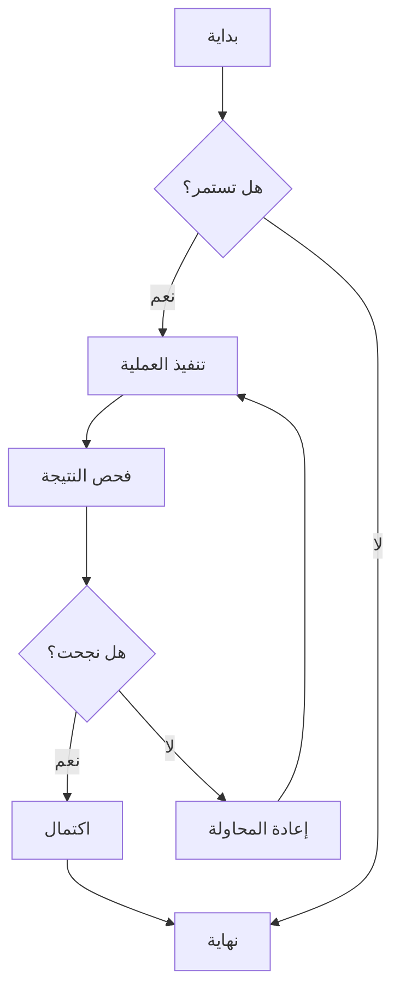
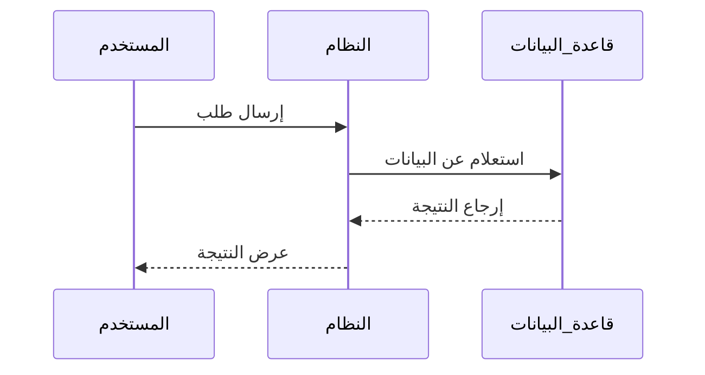
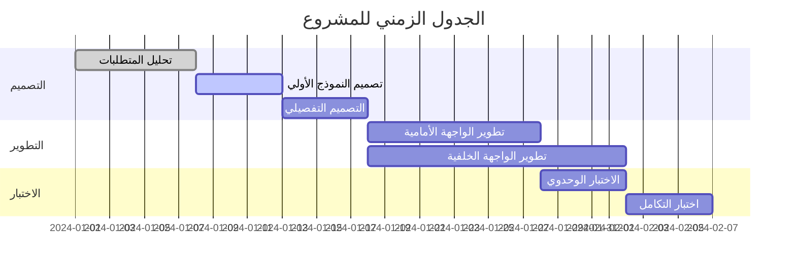
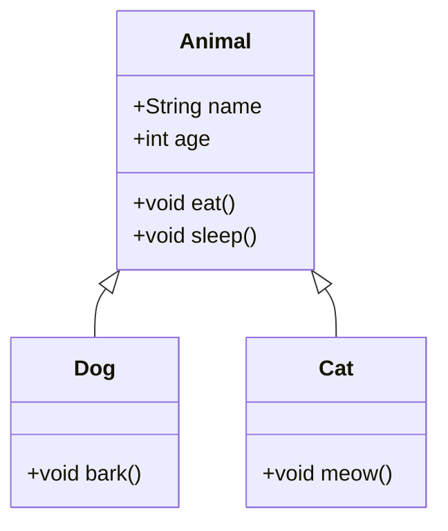
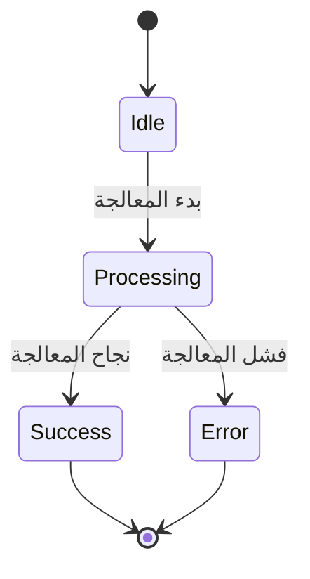
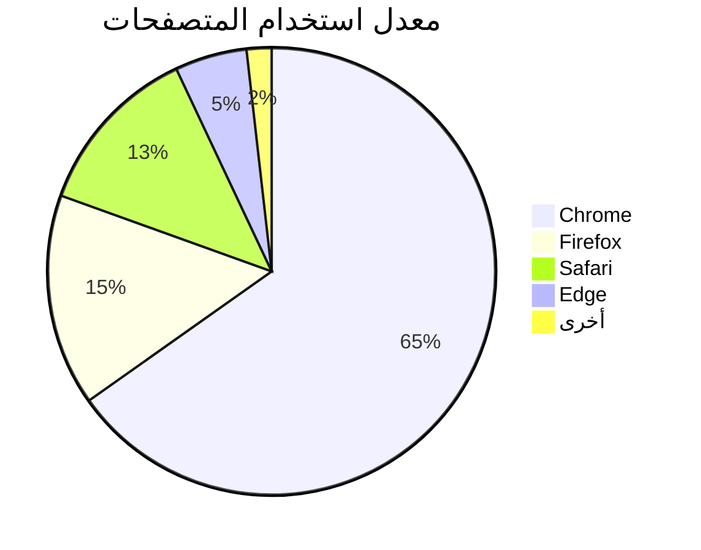

# اختبار مخططات Mermaid

هذا ملف اختبار للتحقق من وظيفة عرض مخططات Mermaid في CZON.

## مثال على المخطط الانسيابي



## مثال على مخطط التسلسل



## مثال على مخطط جانت



## مثال على مخطط الفئات



## مثال على مخطط الحالة



## مثال على المخطط الدائري



## اختبار بناء الجملة الخاطئ (يجب أن يعرض رسالة خطأ)

```mermaid
graph TD
    A --> B
    // هنا تعريف السهم مفقود
    C --> D
```

يحتوي ملف الاختبار هذا على أنواع متعددة من مخططات Mermaid للتحقق من عمل تكامل Mermaid في CZON بشكل صحيح.