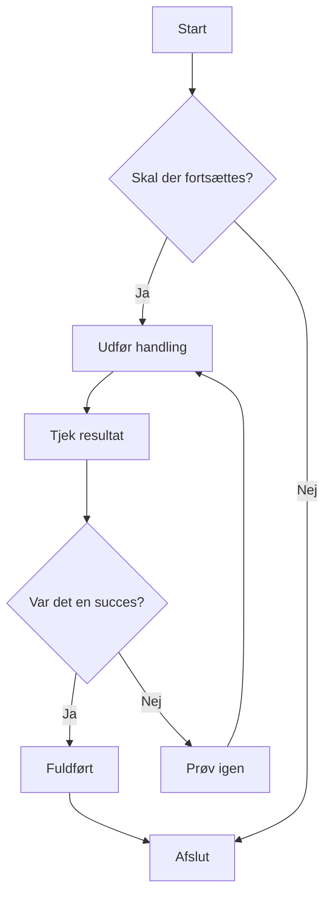
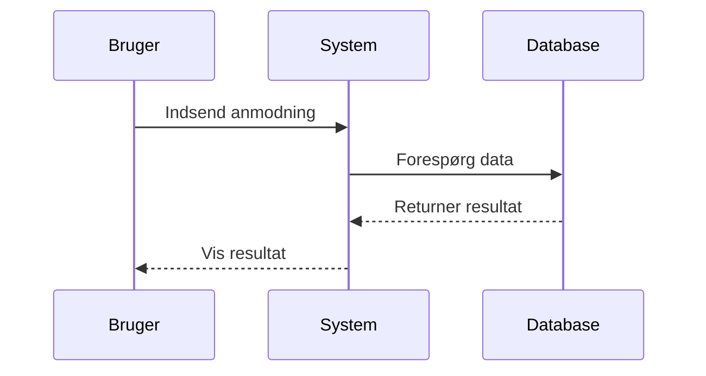
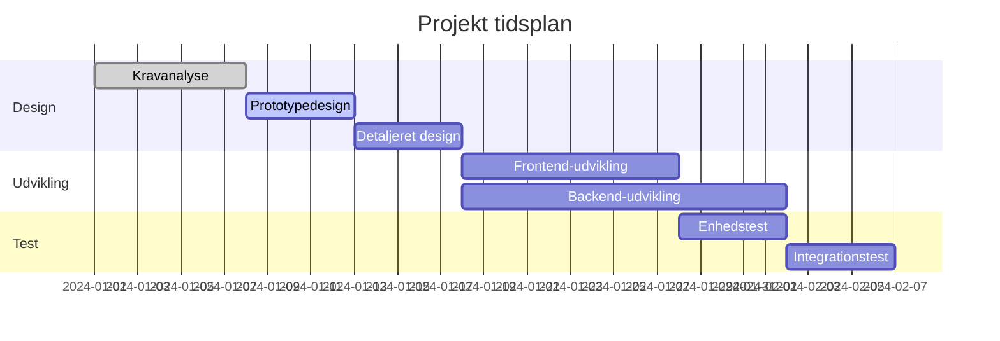
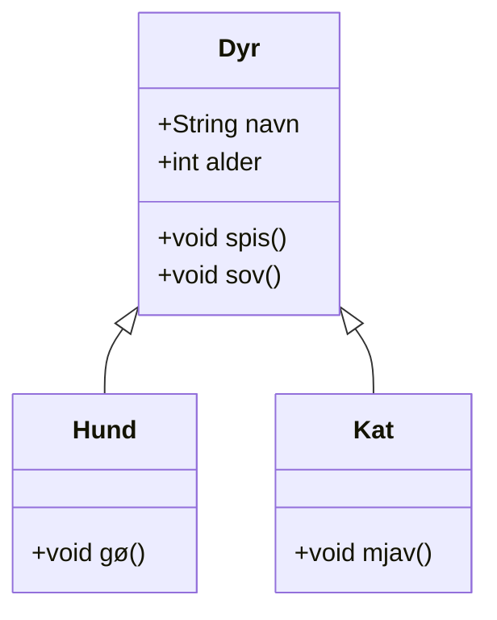
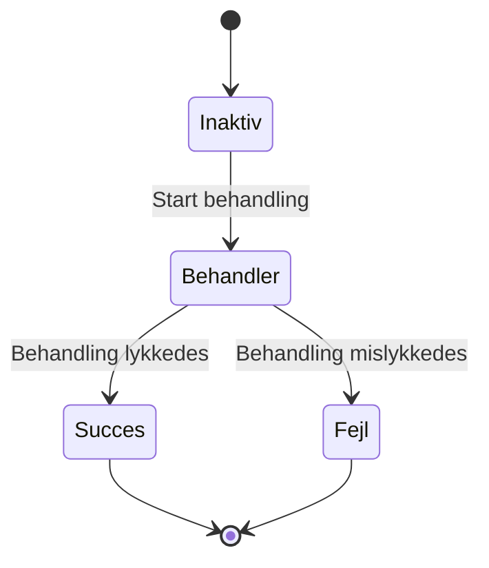
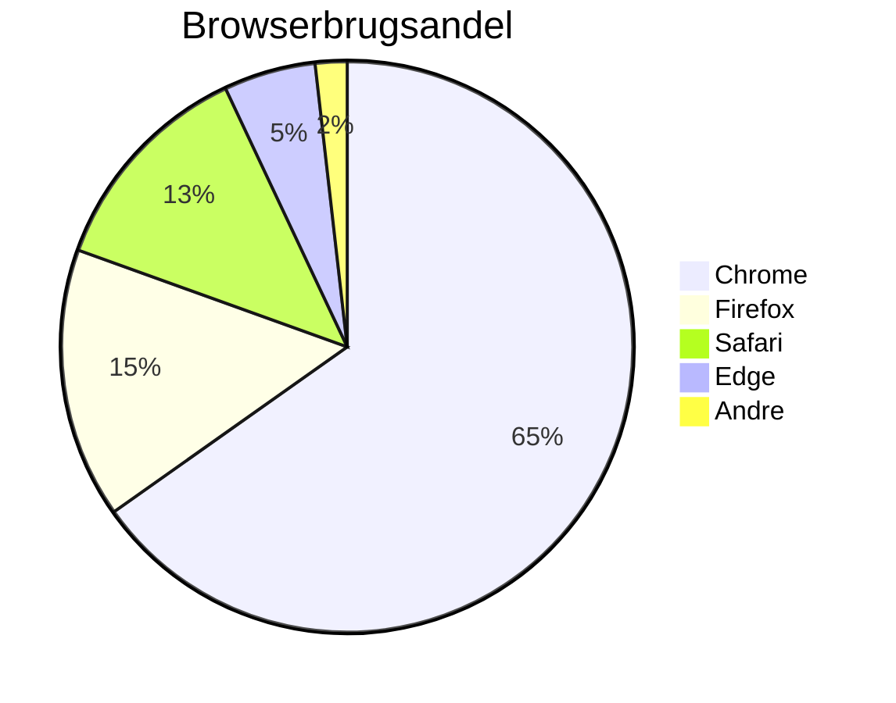

# Mermaid-diagramtest

Dette er en testfil til validering af Mermaid-diagramgengivelsesfunktionen i CZON.

## Flowdiagram-eksempel



## Sekvensdiagram-eksempel



## Gantt-diagram-eksempel



## Klassediagram-eksempel



## Tilstandsdiagram-eksempel



## Lagkagediagram-eksempel



## Fejlsyntakstest (bør vise fejlmeddelelse)

```mermaid
graph TD
    A --> B
    // Mangler pildedefinition her
    C --> D
```

Denne testfil indeholder flere Mermaid-diagramtyper til validering af, om CZONs Mermaid-integration fungerer korrekt.