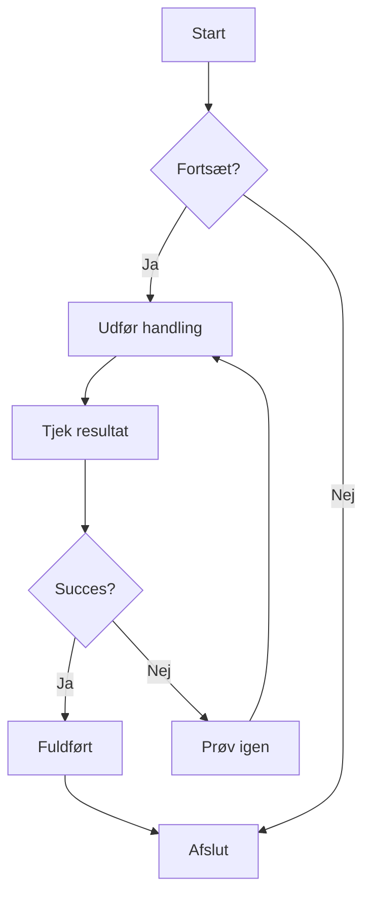
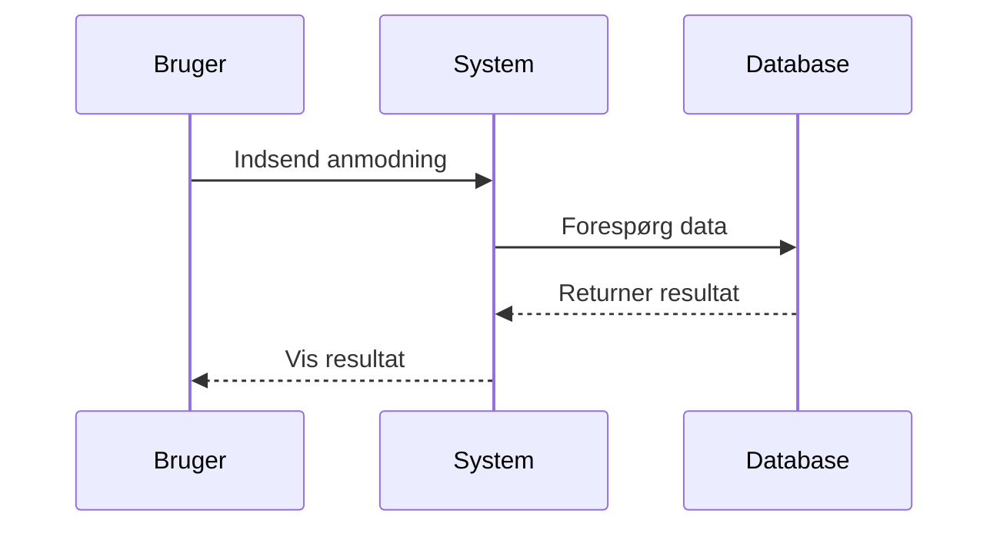
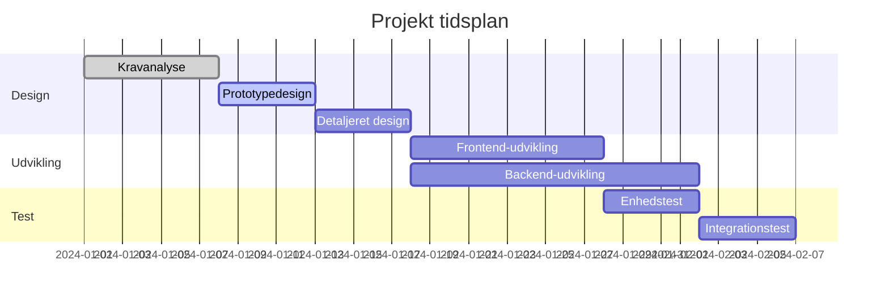
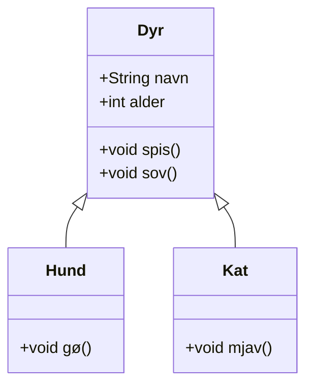
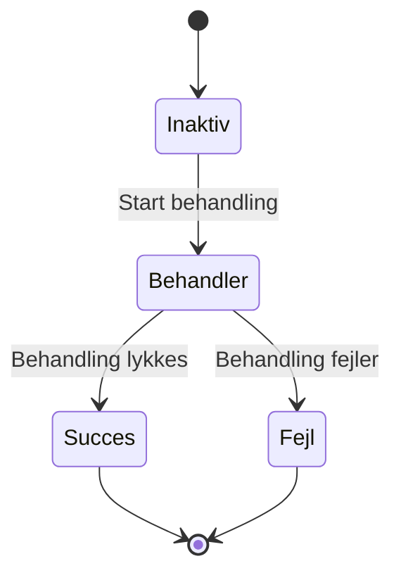
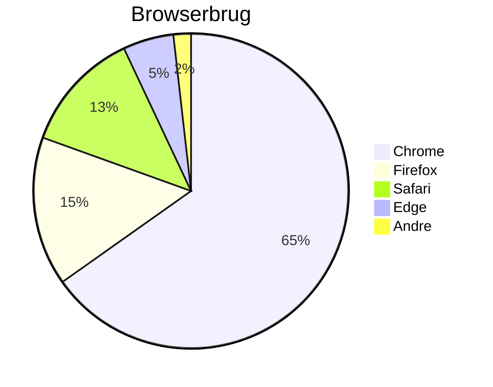

# Mermaid-diagramtest

Dette er en testfil til at verificere Mermaid-diagramrendering i CZON.

## Eksempel på flowdiagram



## Eksempel på sekvensdiagram



## Eksempel på Gantt-diagram



## Eksempel på klassediagram



## Eksempel på tilstandsdiagram



## Eksempel på lagkagediagram



## Testsyntaksfejl (bør vise fejlmeddelelse)

```mermaid
graph TD
    A --> B
    // Mangler pildefinition her
    C --> D
```

Denne testfil indeholder flere Mermaid-diagramtyper til at verificere, om CZONs Mermaid-integration fungerer korrekt.