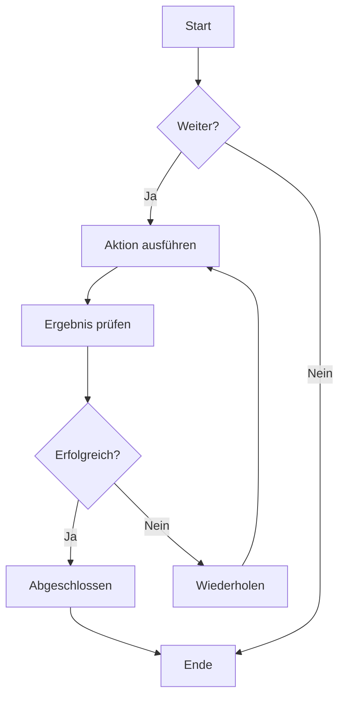
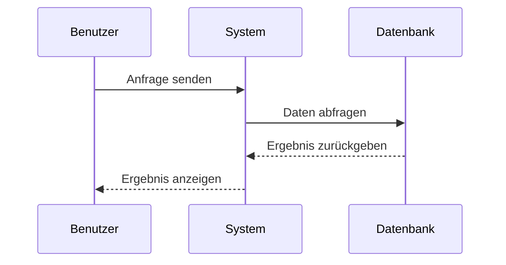
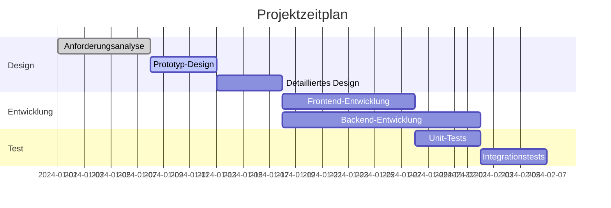
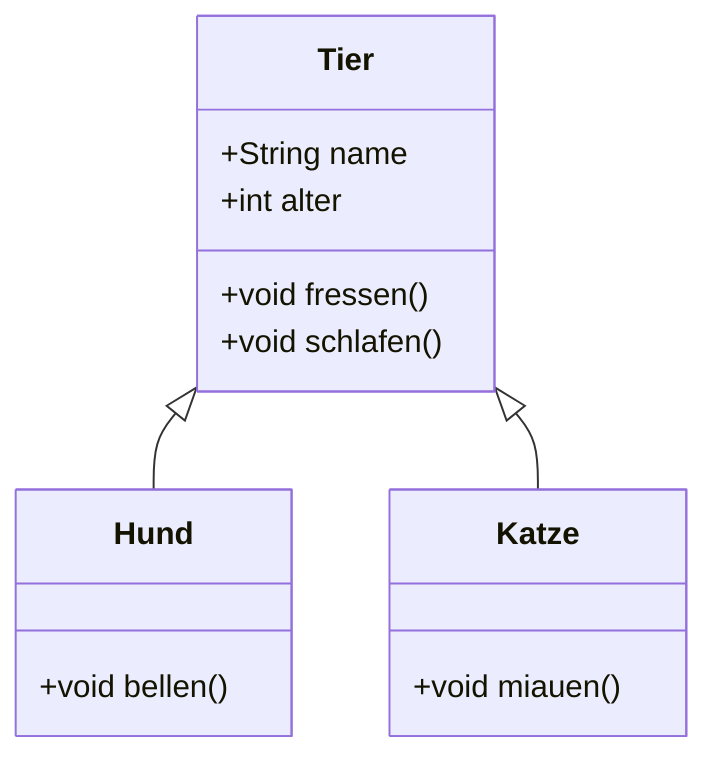
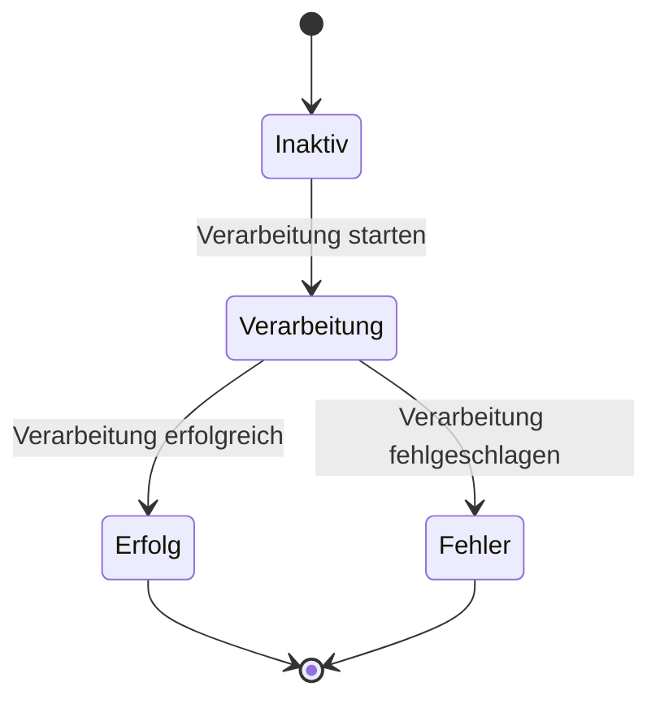
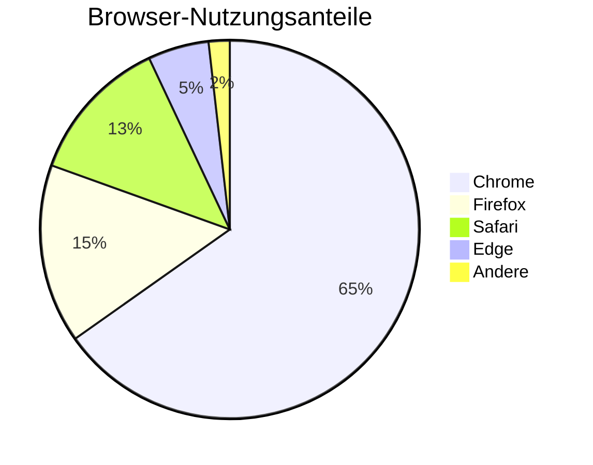

# Mermaid-Diagramm-Test

Dies ist eine Testdatei zur Überprüfung der Mermaid-Diagramm-Renderfunktion in CZON.

## Flussdiagramm-Beispiel



## Sequenzdiagramm-Beispiel



## Gantt-Diagramm-Beispiel



## Klassendiagramm-Beispiel



## Zustandsdiagramm-Beispiel



## Kreisdiagramm-Beispiel



## Fehlerhafte Syntax-Test (sollte eine Fehlermeldung anzeigen)

```mermaid
graph TD
    A --> B
    // Hier fehlt eine Pfeildefinition
    C --> D
```

Diese Testdatei enthält verschiedene Mermaid-Diagrammtypen, um zu überprüfen, ob die Mermaid-Integration in CZON ordnungsgemäß funktioniert.