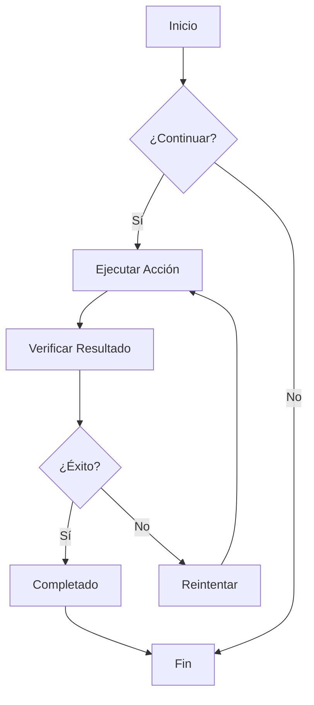
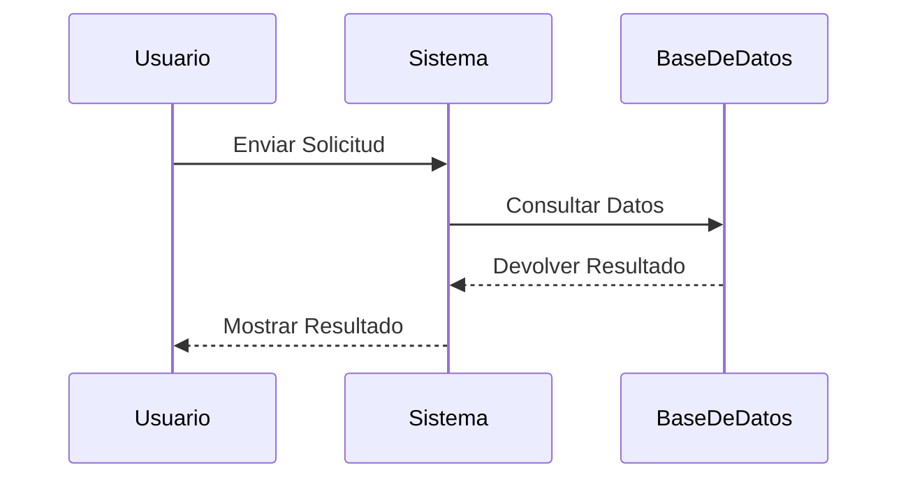
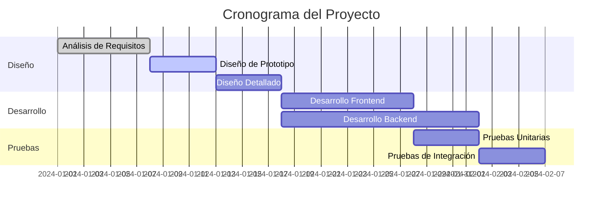
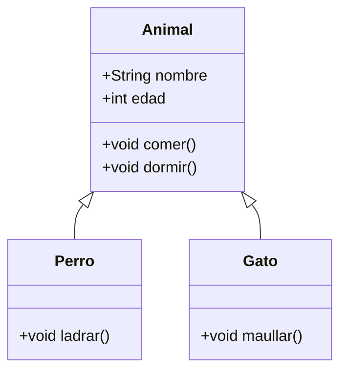
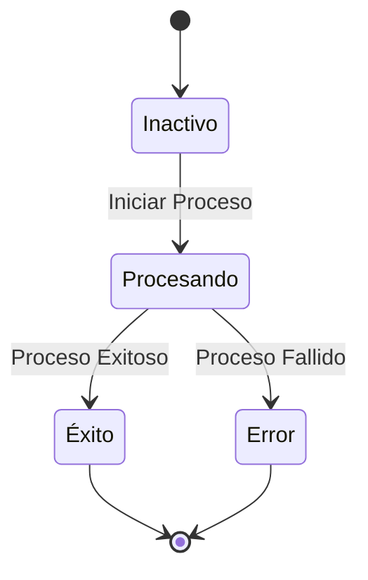
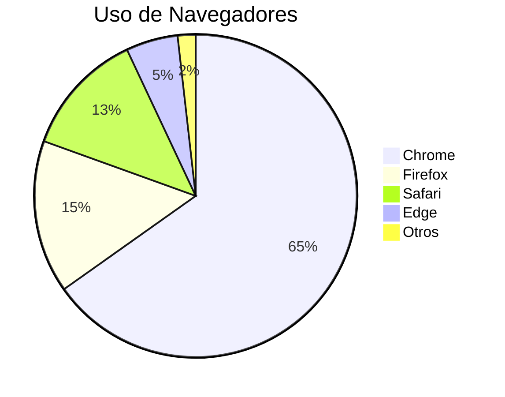

# Prueba de Diagramas Mermaid

Este es un archivo de prueba para verificar la funcionalidad de renderizado de diagramas Mermaid en CZON.

## Ejemplo de Diagrama de Flujo



## Ejemplo de Diagrama de Secuencia



## Ejemplo de Diagrama de Gantt



## Ejemplo de Diagrama de Clases



## Ejemplo de Diagrama de Estado



## Ejemplo de Gráfico Circular



## Prueba de Sintaxis Errónea (debería mostrar un mensaje de error)

```mermaid
graph TD
    A --> B
    // Falta definición de flecha aquí
    C --> D
```

Este archivo de prueba incluye varios tipos de diagramas Mermaid para verificar si la integración de Mermaid en CZON funciona correctamente.