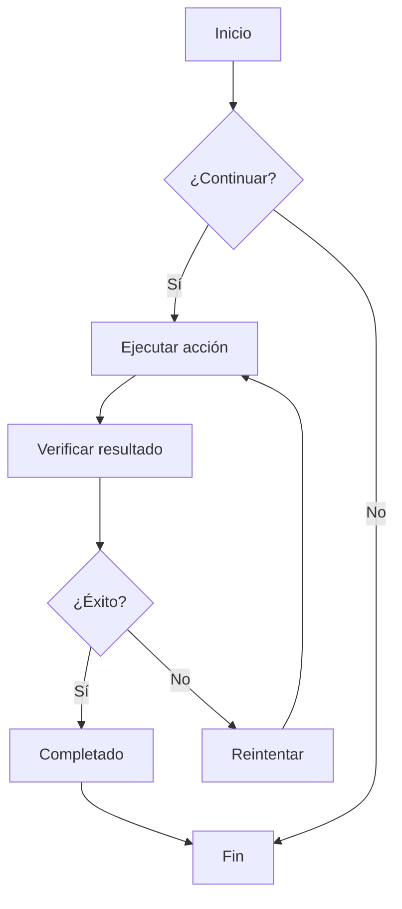
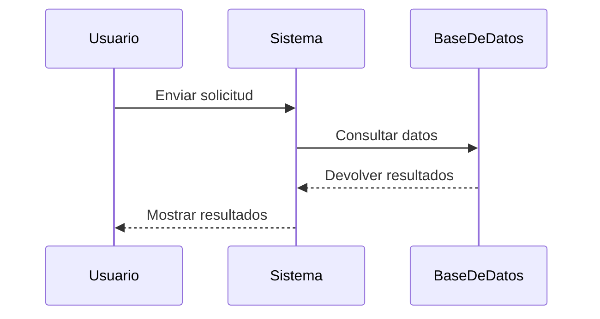
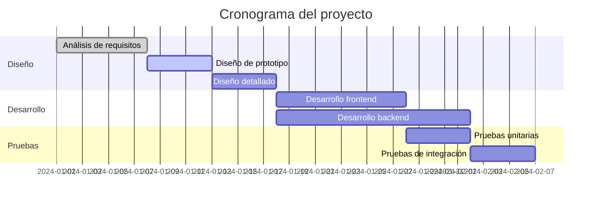
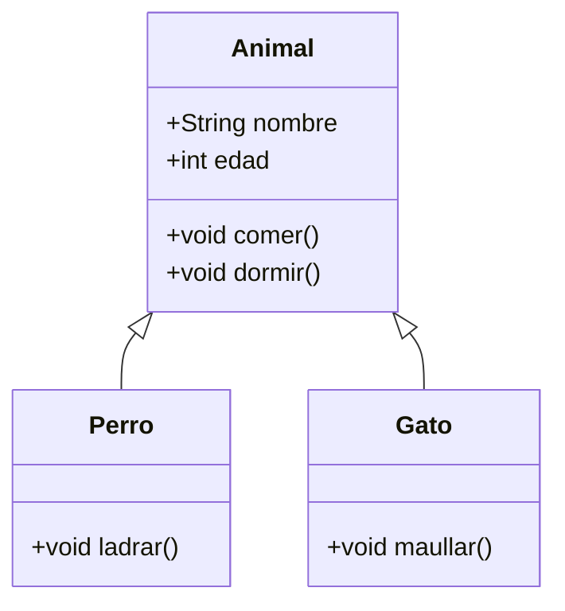
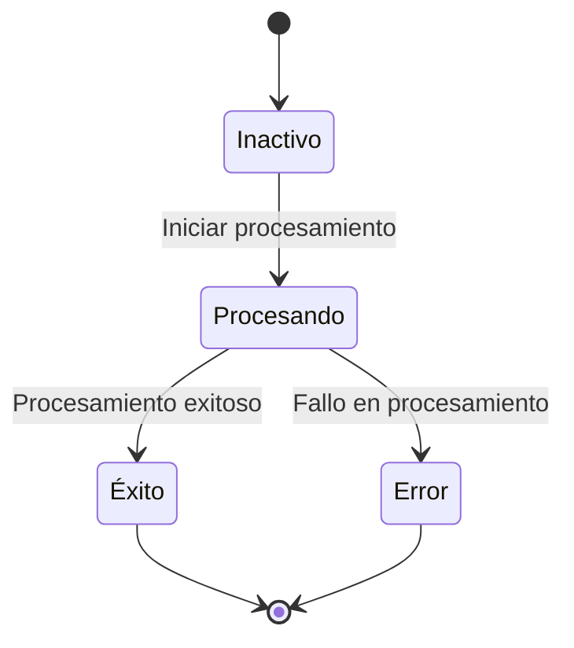
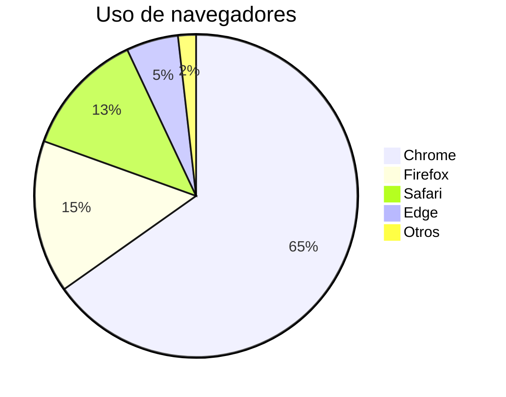

# Prueba de diagramas Mermaid

Este es un archivo de prueba para verificar la funcionalidad de renderizado de diagramas Mermaid en CZON.

## Ejemplo de flujograma



## Ejemplo de diagrama de secuencia



## Ejemplo de diagrama de Gantt



## Ejemplo de diagrama de clases



## Ejemplo de diagrama de estado



## Ejemplo de gráfico circular



## Prueba de sintaxis errónea (debería mostrar mensaje de error)

```mermaid
graph TD
    A --> B
    // Falta definición de flecha aquí
    C --> D
```

Este archivo de prueba incluye múltiples tipos de diagramas Mermaid para verificar que la integración de Mermaid en CZON funcione correctamente.