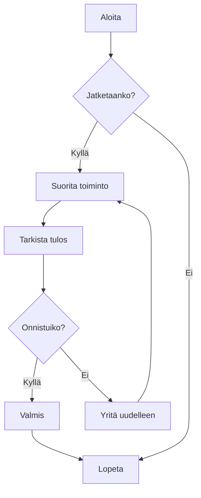
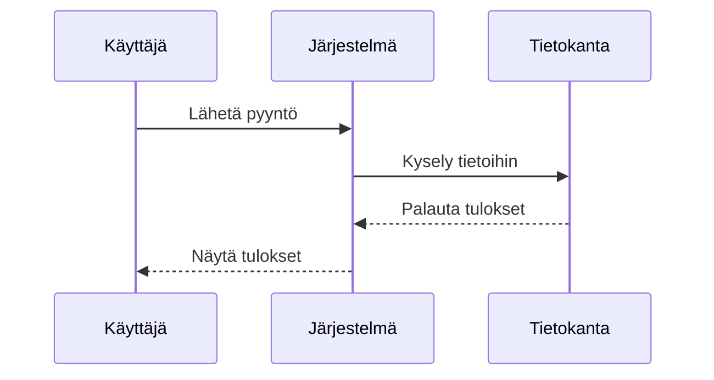
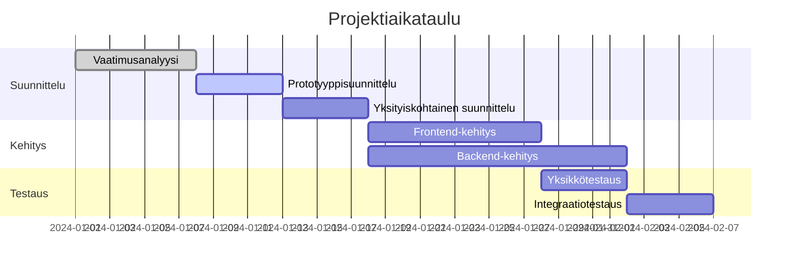
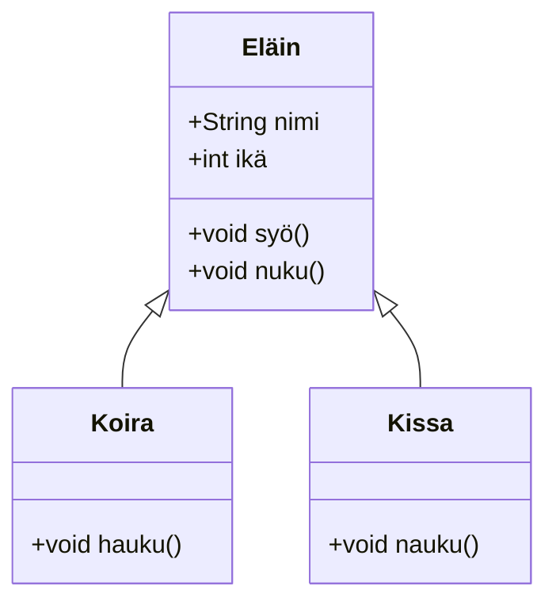
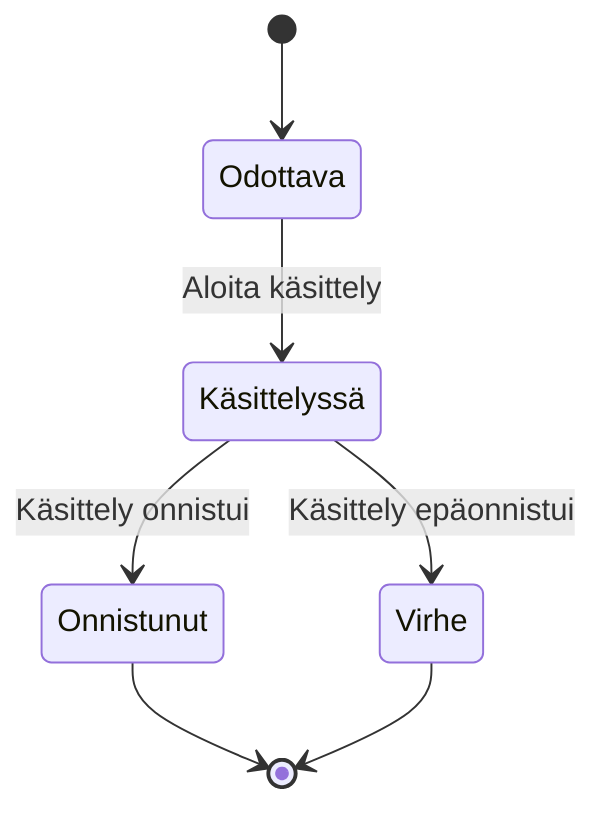
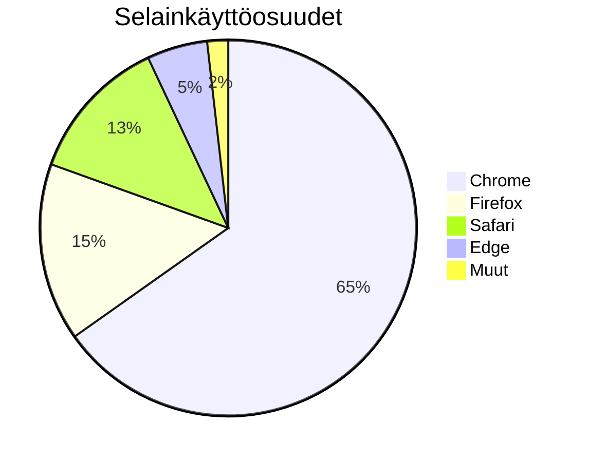

# Mermaid-kaavioiden testaus

Tämä on testitiedosto, jolla varmistetaan Mermaid-kaavioiden renderöintitoiminto CZON:ssa.

## Vuokaavio-esimerkki



## Sekvenssikaavio-esimerkki



## Gantt-kaavio-esimerkki



## Luokkakaavio-esimerkki



## Tilakaavio-esimerkki



## Ympyräkaavio-esimerkki



## Virheellisen syntaksin testaus (pitäisi näyttää virheilmoitus)

```mermaid
graph TD
    A --> B
    // Täältä puuttuu nuolen määritelmä
    C --> D
```

Tämä testitiedosto sisältää useita Mermaid-kaaviotyyppejä, joiden avulla varmistetaan, että CZON:n Mermaid-integraatio toimii odotetusti.
