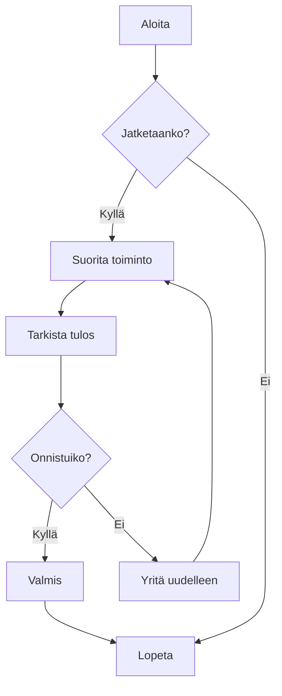
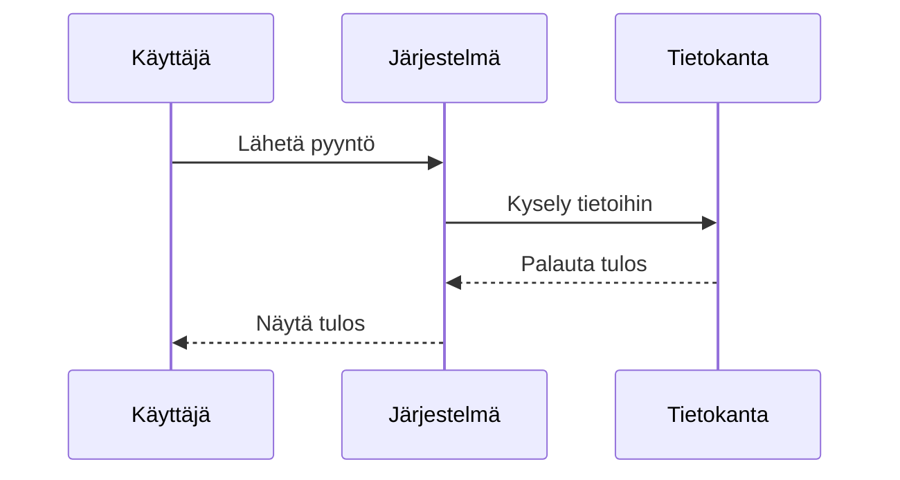
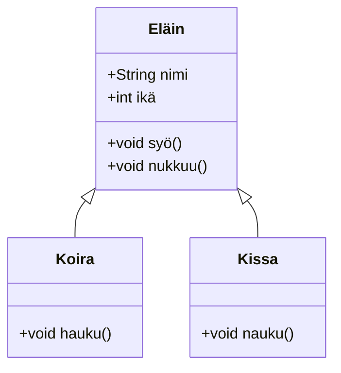
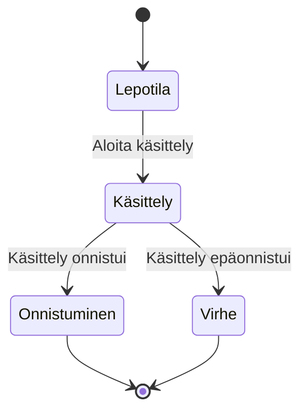
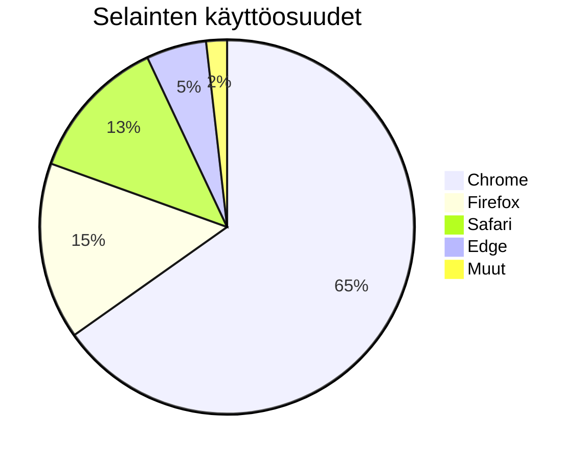

# Mermaid-kaavioiden testaus

Tämä on testitiedosto, jolla varmistetaan CZON-alustan Mermaid-kaavioiden renderöintitoiminto.

## Vuokaavio-esimerkki



## Sekvenssikaavio-esimerkki



## Gantt-kaavio-esimerkki


## Luokkakaavio-esimerkki



## Tilakaavio-esimerkki



## Ympyräkaavio-esimerkki



## Virheellisen syntaksin testaus (pitäisi näyttää virheilmoitus)

```mermaid
graph TD
    A --> B
    // Täältä puuttuu nuolen määritelmä
    C --> D
```

Tämä testitiedosto sisältää useita Mermaid-kaaviotyyppejä, joilla varmistetaan, että CZON-alustan Mermaid-integraatio toimii oikein.