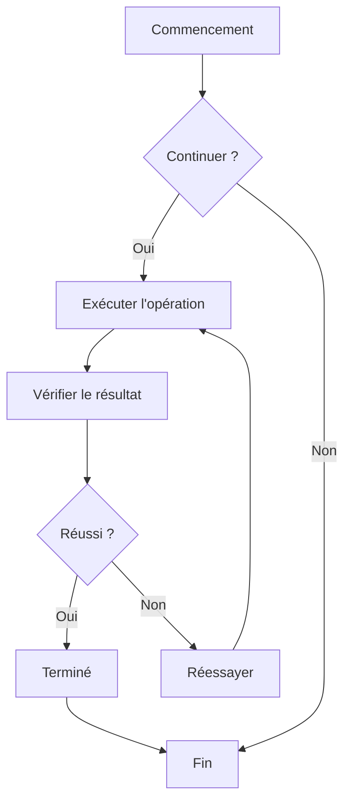
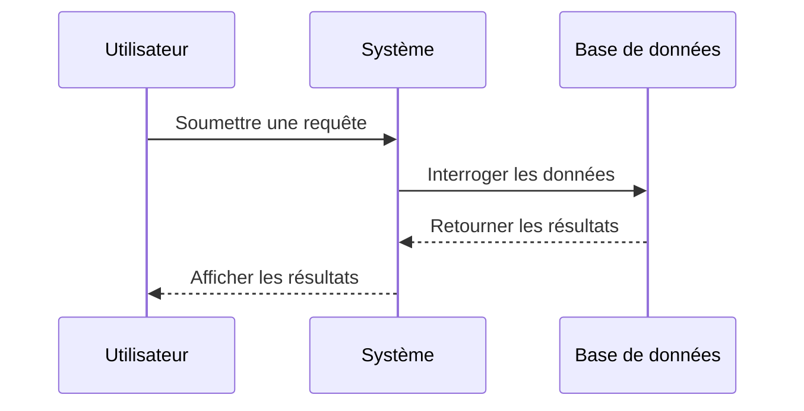
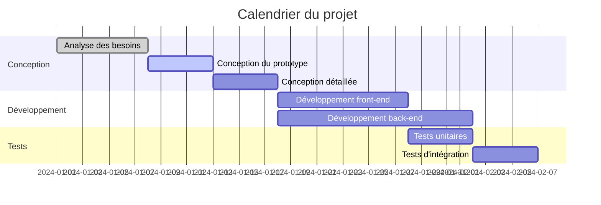
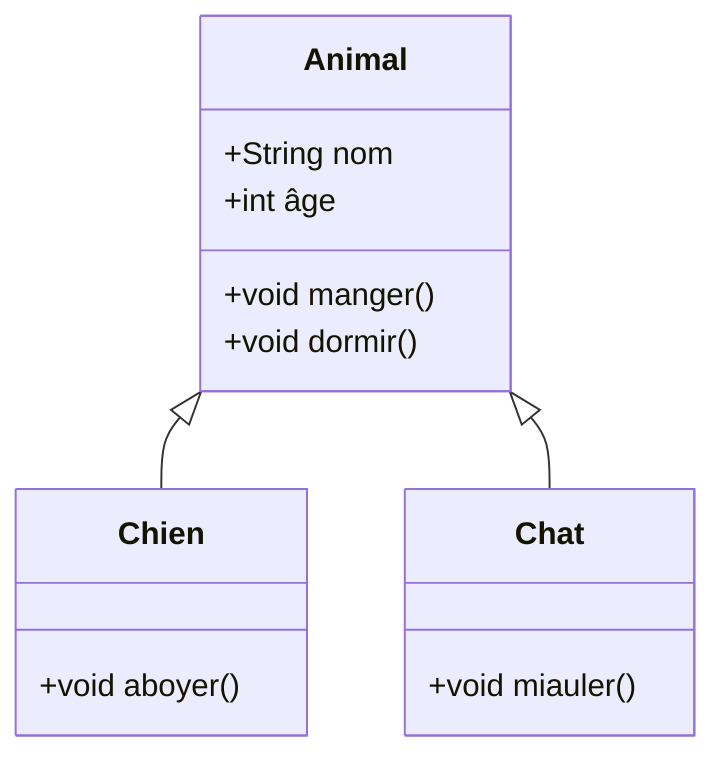
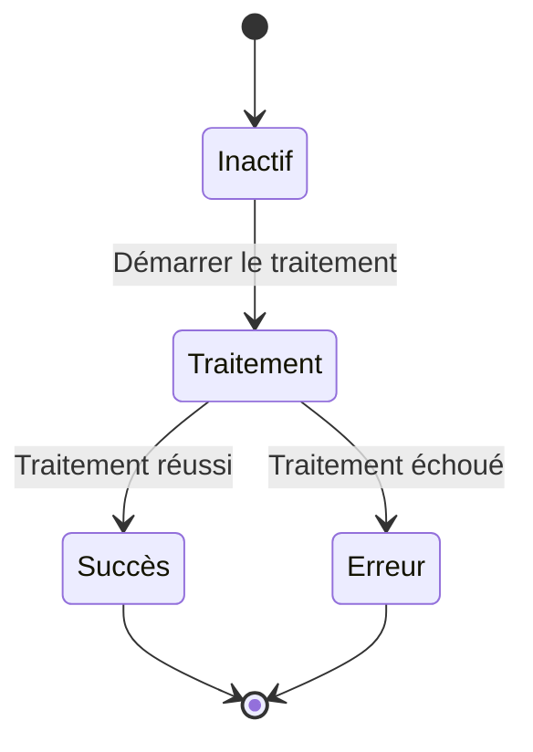
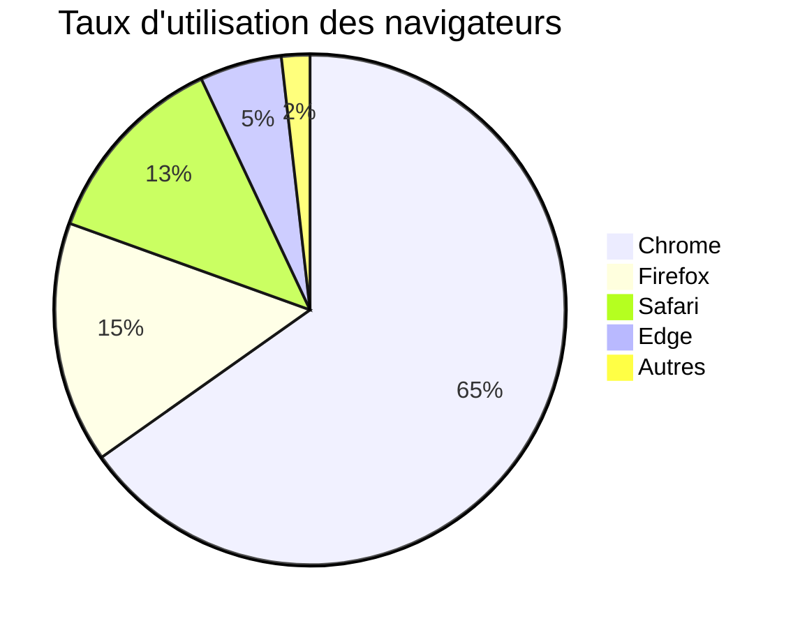

# Test des diagrammes Mermaid

Ceci est un fichier de test pour valider la fonctionnalité de rendu des diagrammes Mermaid dans CZON.

## Exemple d'organigramme



## Exemple de diagramme de séquence



## Exemple de diagramme de Gantt



## Exemple de diagramme de classes



## Exemple de diagramme d'état



## Exemple de diagramme circulaire



## Test de syntaxe erronée (devrait afficher un message d'erreur)

```mermaid
graph TD
    A --> B
    // Définition de flèche manquante ici
    C --> D
```

Ce fichier de test contient plusieurs types de diagrammes Mermaid pour vérifier que l'intégration de Mermaid dans CZON fonctionne correctement.