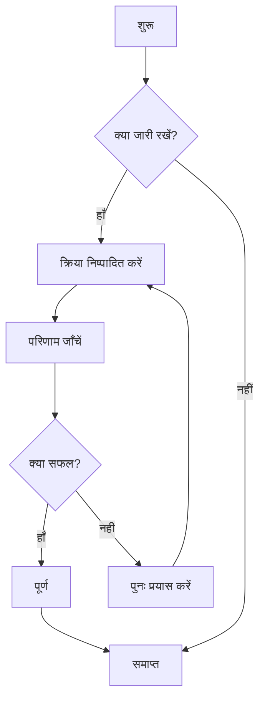
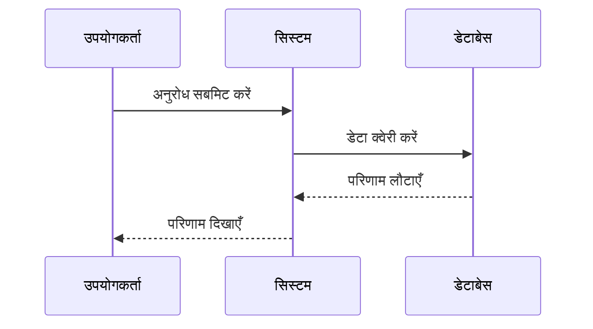
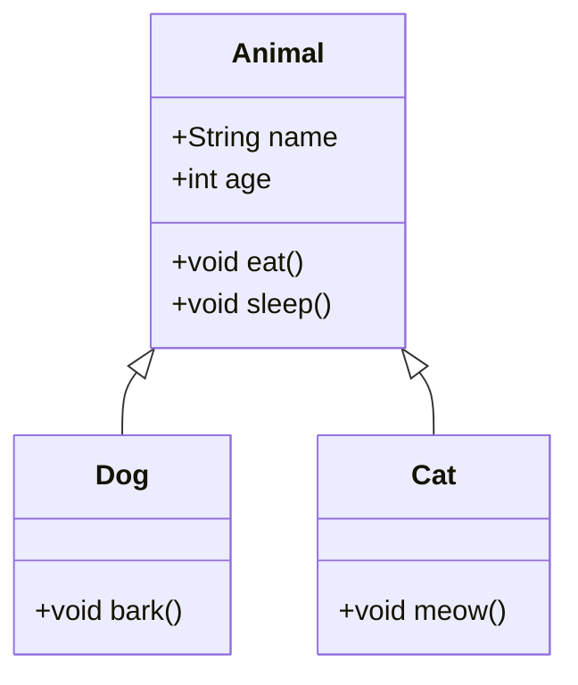
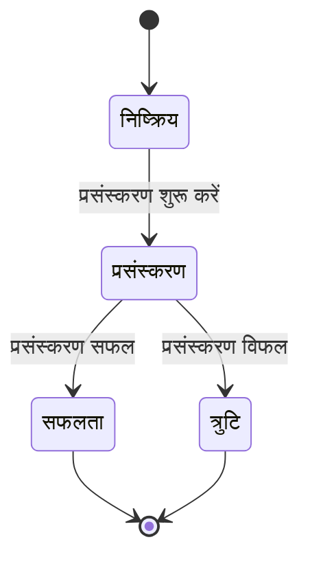
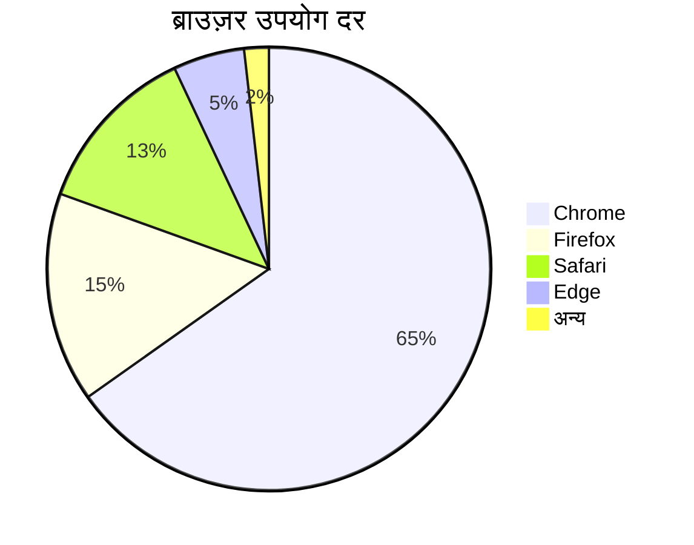

# Mermaid चार्ट परीक्षण

यह CZON में Mermaid चार्ट रेंडरिंग कार्यक्षमता को सत्यापित करने के लिए एक परीक्षण फ़ाइल है।

## फ़्लोचार्ट उदाहरण



## सीक्वेंस डायग्राम उदाहरण



## गैंट चार्ट उदाहरण

```mermaid
gantt
    title परियोजना समयसारणी
    dateFormat  YYYY-MM-DD
    section डिज़ाइन
    आवश्यकता विश्लेषण     :पूर्ण,    des1, 2024-01-01, 7d
    प्रोटोटाइप डिज़ाइन     :सक्रिय,  des2, 2024-01-08, 5d
    विस्तृत डिज़ाइन     :         des3, des2 के बाद, 5d
    section विकास
    फ्रंटएंड विकास     :         dev1, des3 के बाद, 10d
    बैकएंड विकास     :         dev2, des3 के बाद, 15d
    section परीक्षण
    यूनिट परीक्षण     :         test1, dev1 के बाद, 5d
    एकीकरण परीक्षण     :         test2, dev2 के बाद, 5d
```

## क्लास डायग्राम उदाहरण



## स्टेट डायग्राम उदाहरण



## पाई चार्ट उदाहरण



## त्रुटिपूर्ण वाक्यविन्यास परीक्षण (त्रुटि संदेश दिखना चाहिए)

```mermaid
graph TD
    A --> B
    // यहाँ तीर परिभाषा गायब है
    C --> D
```

इस परीक्षण फ़ाइल में विभिन्न Mermaid चार्ट प्रकार शामिल हैं, जो CZON के Mermaid एकीकरण के सही ढंग से कार्य करने को सत्यापित करने के लिए हैं।