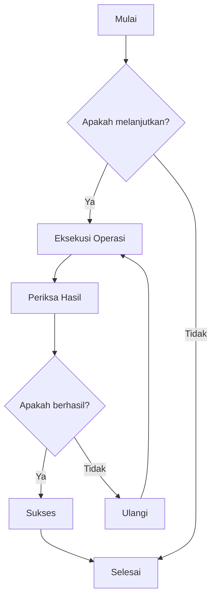
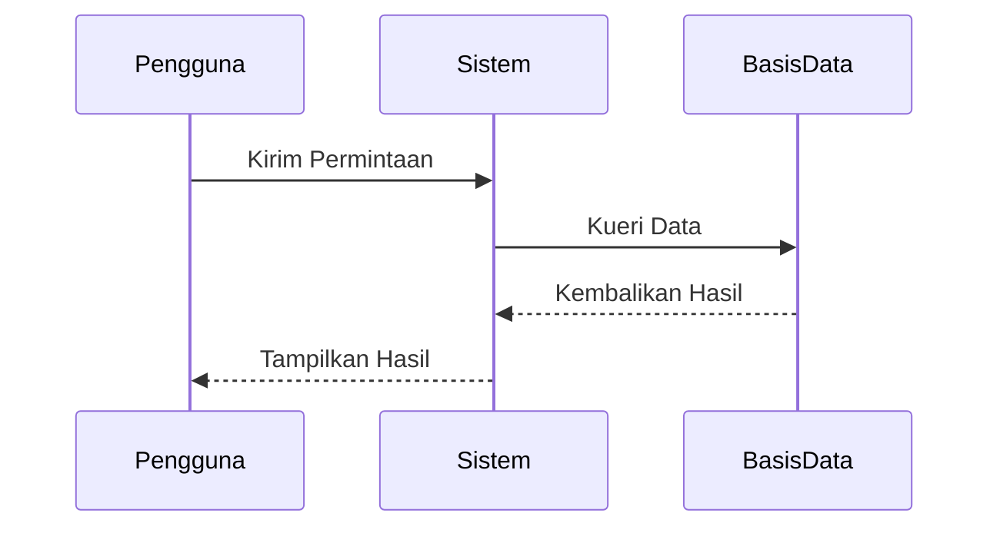
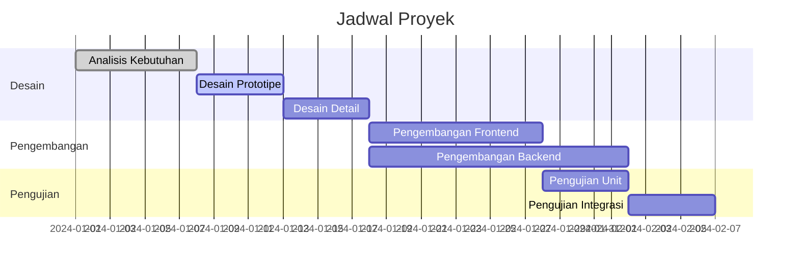
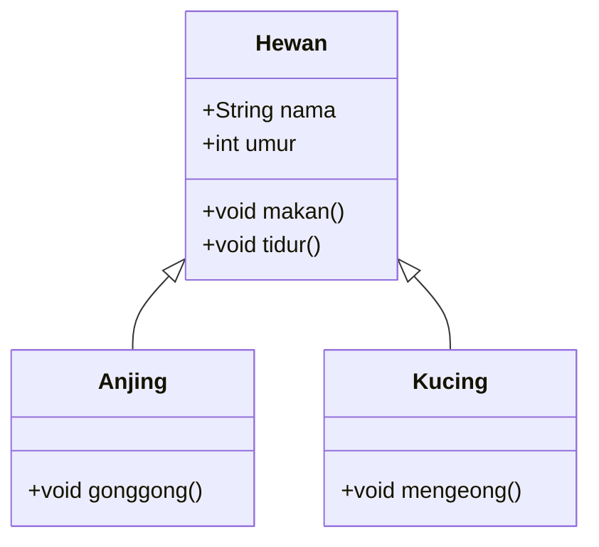
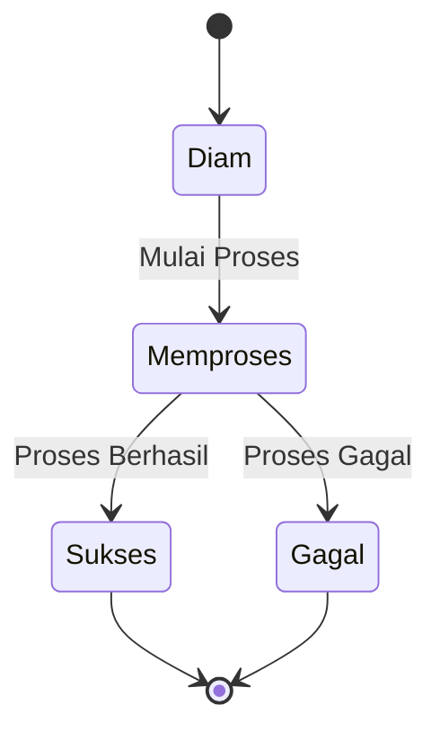
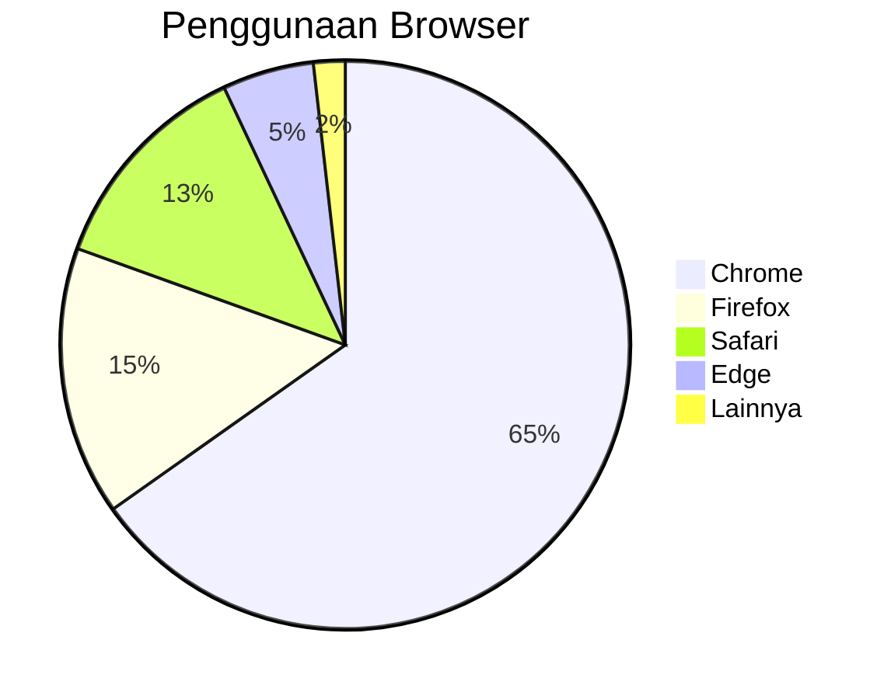

# Pengujian Diagram Mermaid

Ini adalah file pengujian untuk memverifikasi fungsi render diagram Mermaid di CZON.

## Contoh Diagram Alir



## Contoh Diagram Urutan



## Contoh Diagram Gantt



## Contoh Diagram Kelas



## Contoh Diagram Keadaan



## Contoh Diagram Pai



## Pengujian Sintaksis Salah (Seharusnya Menampilkan Pesan Kesalahan)

```mermaid
graph TD
    A --> B
    // Definisi panah di sini hilang
    C --> D
```

File pengujian ini berisi berbagai tipe diagram Mermaid untuk memverifikasi apakah integrasi Mermaid di CZON berfungsi dengan normal.