# Test diagrammi Mermaid

Questo è un file di test per verificare la funzionalità di rendering dei diagrammi Mermaid in CZON.

## Esempio di diagramma di flusso


## Esempio di diagramma di sequenza


## Esempio di diagramma di Gantt


## Esempio di diagramma delle classi


## Esempio di diagramma di stato

```mermaid
stateDiagram-v2
    [*] --> Inattivo
    Inattivo --> Elaborazione : Avvia elaborazione
    Elaborazione --> Successo : Elaborazione riuscita
    Elaborazione --> Errore : Elaborazione fallita
    Successo --> [*]
    Errore --> [*]
```



## Esempio di diagramma a torta


## Test sintassi errata (dovrebbe mostrare un messaggio di errore)

```mermaid
graph TD
    A --> B
    // Qui manca la definizione della freccia
    C --> D
```

Questo file di test include vari tipi di diagrammi Mermaid per verificare se l'integrazione di Mermaid in CZON funziona correttamente.
