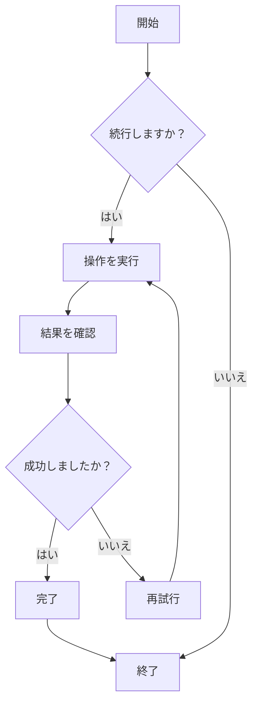
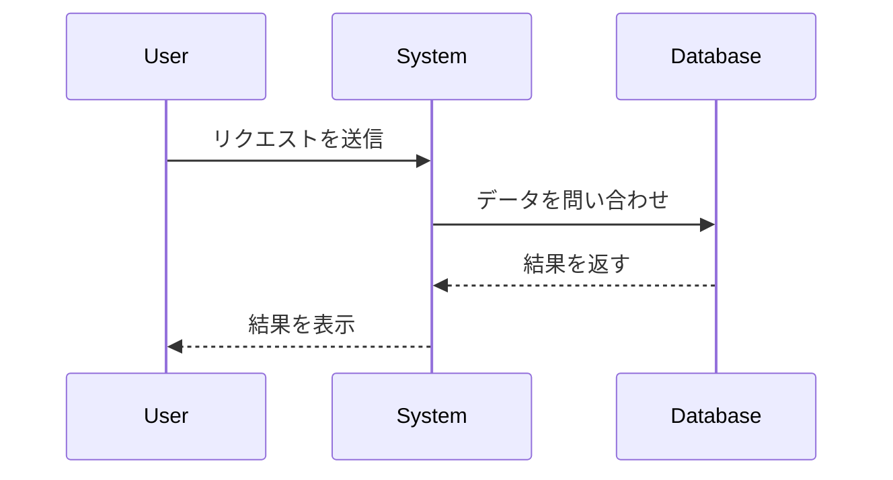
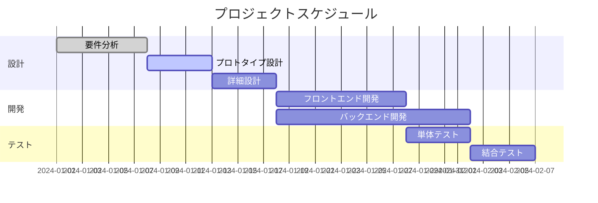
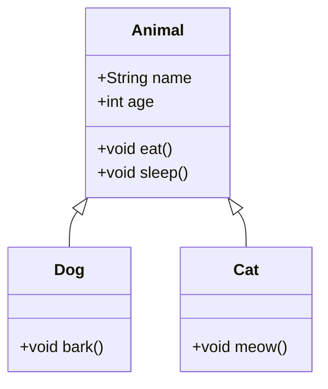
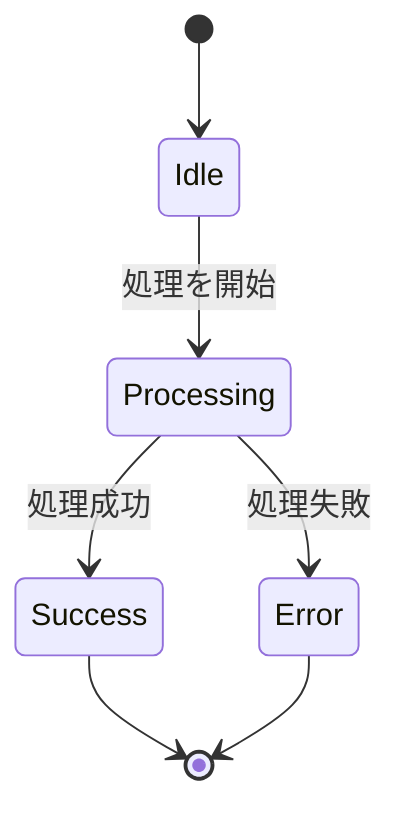
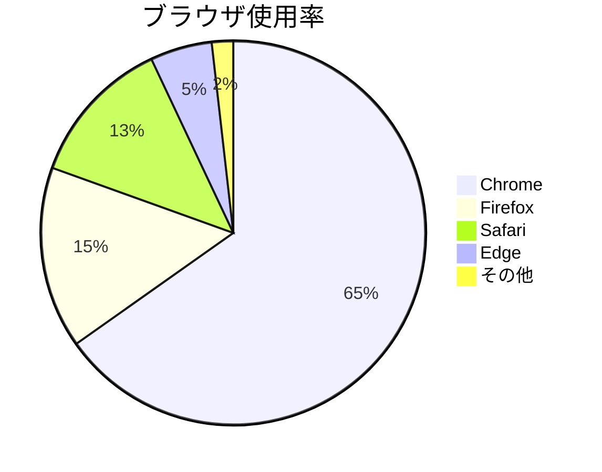

# Mermaid 図表テスト

これは、CZONにおけるMermaid図表のレンダリング機能を検証するためのテストファイルです。

## フローチャートの例



## シーケンス図の例



## ガントチャートの例



## クラス図の例



## 状態図の例



## 円グラフの例



## 誤った構文のテスト（エラーメッセージが表示されるはず）

```mermaid
graph TD
    A --> B
    // ここに矢印の定義が不足しています
    C --> D
```

このテストファイルには、CZONのMermaid統合が正常に動作するかどうかを検証するための、さまざまなMermaid図表タイプが含まれています。
