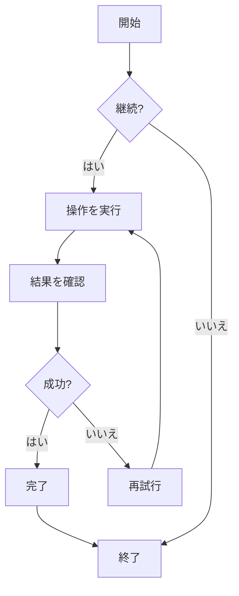
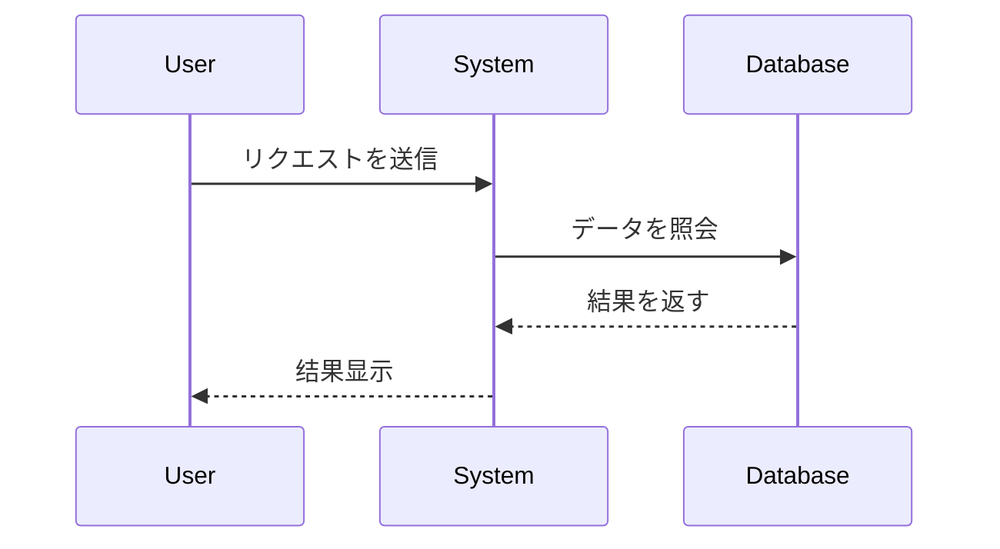
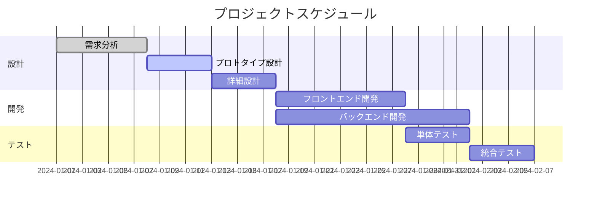
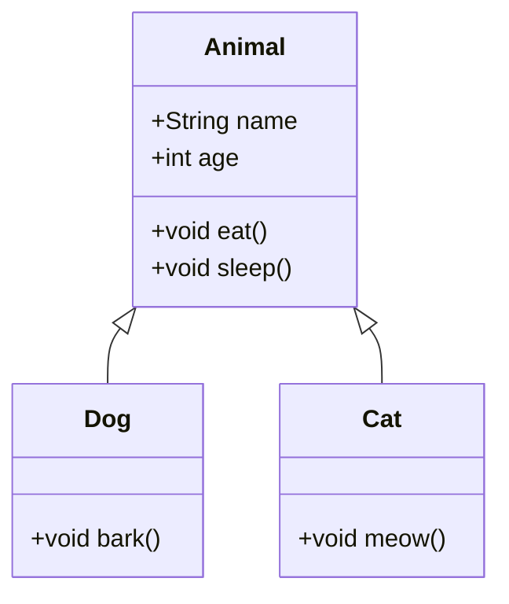
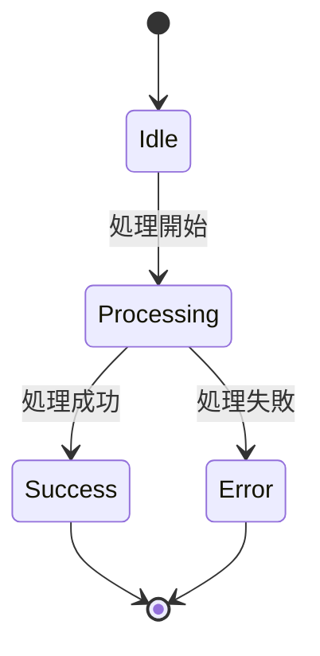
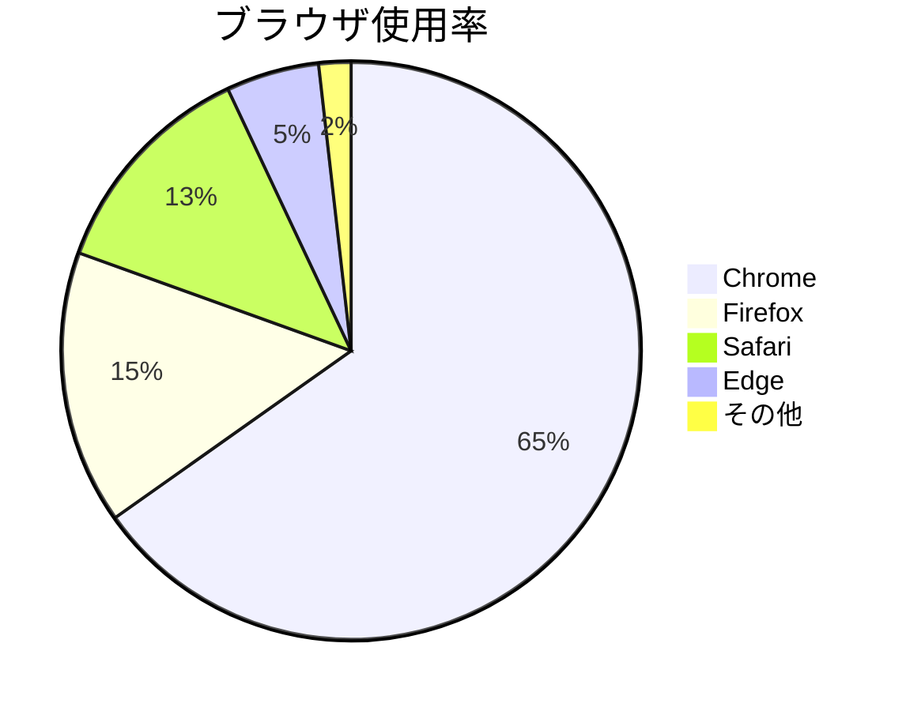

# Mermaid チャートテスト

これは CZON における Mermaid チャートレンダリング機能を検証するためのテストファイルです。

## フローチャートの例

```mermaid
graph TD
    A[開始] --> B{継続?}
    B -->|はい| C[操作を実行]
    B -->|いいえ| D[終了]
    C --> E[結果を確認]
    E --> F{成功?}
    F -->|はい| G[完了]
    F -->|いいえ| H[再試行]
    H --> C
    G --> D
```

## シーケンス図の例

```mermaid
sequenceDiagram
    participant User
    participant System
    participant Database

    User->>System: リクエストを送信
    System->>Database: データを照会
    Database-->>System: 結果を返す
    System-->>User:结果显示
```

## ガント図の例

```mermaid
gantt
    title プロジェクトスケジュール
    dateFormat  YYYY-MM-DD
    section 設計
    需求分析     :done,    des1, 2024-01-01, 7d
    プロトタイプ設計     :active,  des2, 2024-01-08, 5d
    詳細設計     :         des3, after des2, 5d
    section 開発
    フロントエンド開発     :         dev1, after des3, 10d
    バックエンド開発     :         dev2, after des3, 15d
    section テスト
    単体テスト     :         test1, after dev1, 5d
    統合テスト     :         test2, after dev2, 5d
```

## クラス図の例

```mermaid
classDiagram
    class Animal {
        +String name
        +int age
        +void eat()
        +void sleep()
    }
    class Dog {
        +void bark()
    }
    class Cat {
        +void meow()
    }

    Animal <|-- Dog
    Animal <|-- Cat
```

## ステート図の例

```mermaid
stateDiagram-v2
    [*] --> Idle
    Idle --> Processing : 処理開始
    Processing --> Success : 処理成功
    Processing --> Error : 処理失敗
    Success --> [*]
    Error --> [*]
```

## 円グラフの例

```mermaid
pie title ブラウザ使用率
    "Chrome" : 65.2
    "Firefox" : 15.3
    "Safari" : 12.5
    "Edge" : 5.2
    "その他" : 1.8
```

## エラー構文テスト（エラーメッセージを表示）

```mermaid
graph TD
    A --> B
    //  здесь отсутствует определение стрелки
    C --> D
```

このテストファイルには複数の Mermaid チャートタイプが含まれており、CZON の Mermaid 統合が正常に動作しているかを検証します。
