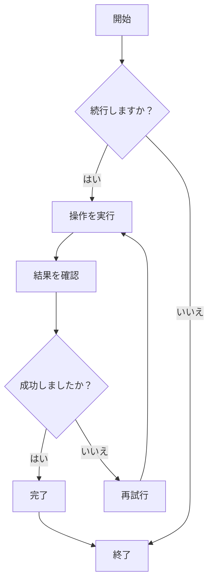
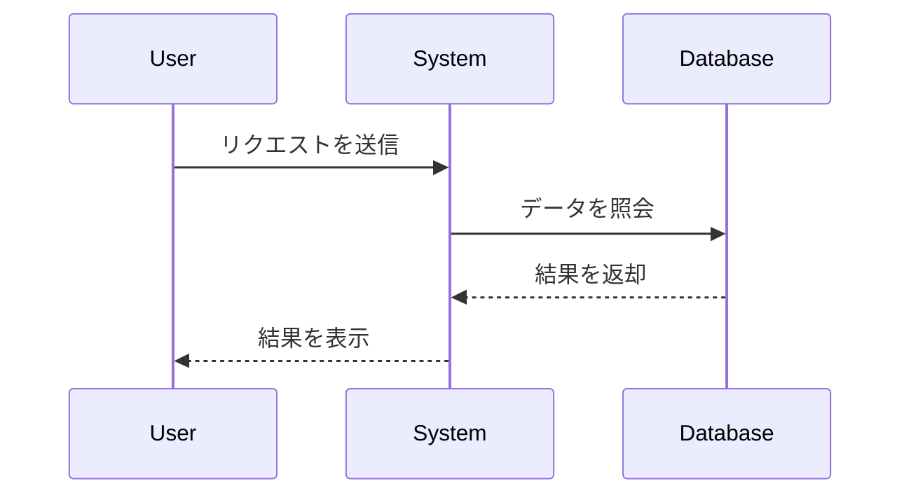
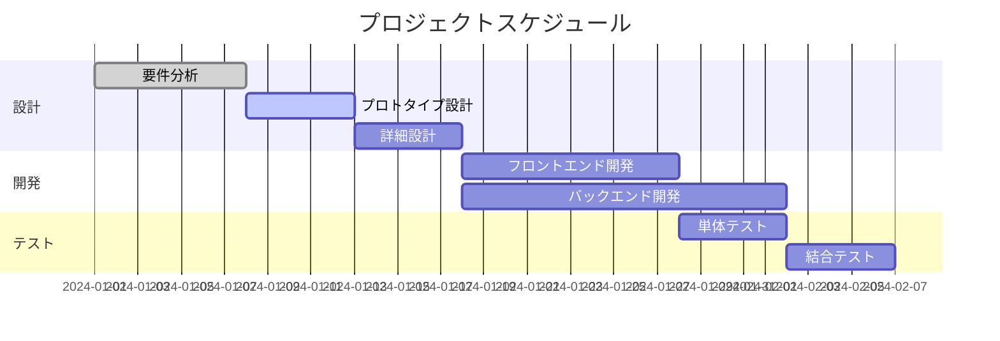
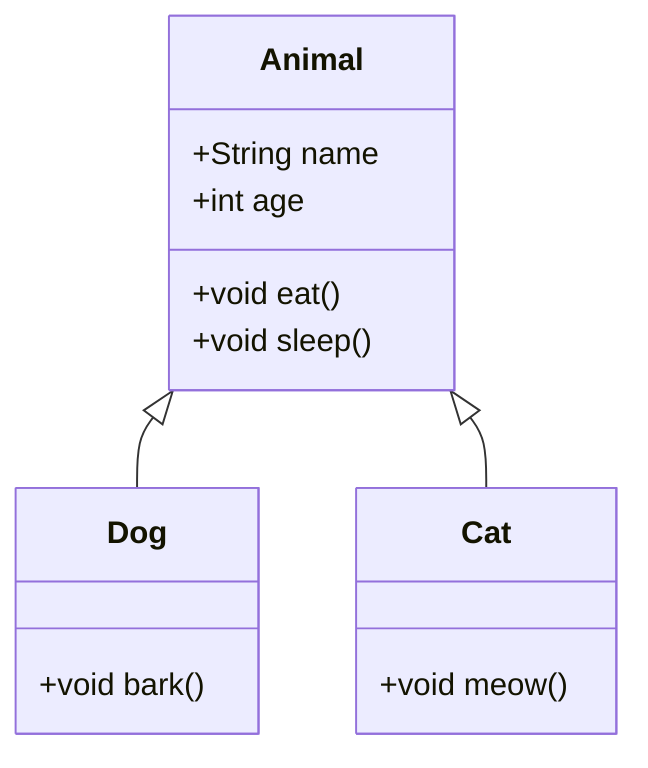
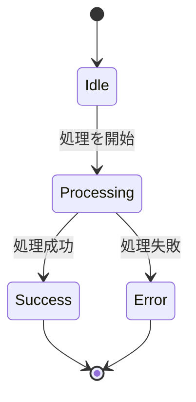
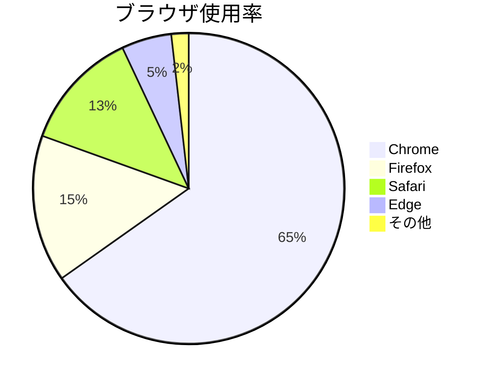

# Mermaid 図表テスト

これは、CZONにおけるMermaid図表レンダリング機能を検証するためのテストファイルです。

## フローチャートの例



## シーケンス図の例



## ガントチャートの例



## クラス図の例



## 状態図の例



## 円グラフの例



## 誤った構文のテスト（エラーメッセージが表示されるはずです）

```mermaid
graph TD
    A --> B
    // ここに矢印の定義が不足しています
    C --> D
```

このテストファイルには、CZONのMermaid統合が正常に動作するかを検証するための、様々なMermaid図表タイプが含まれています。