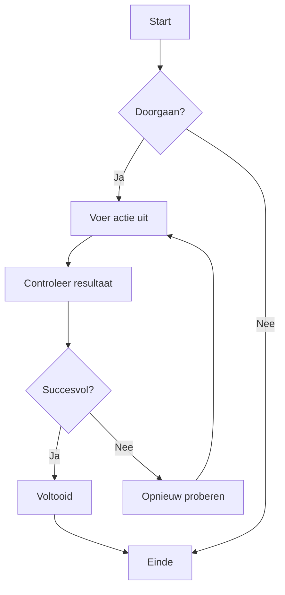
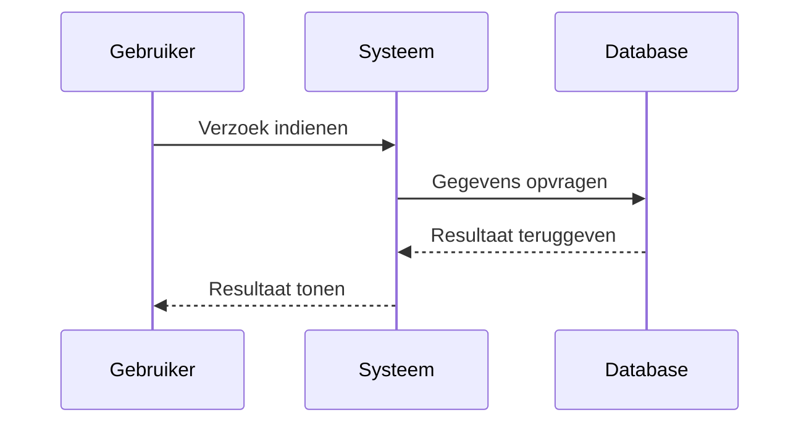
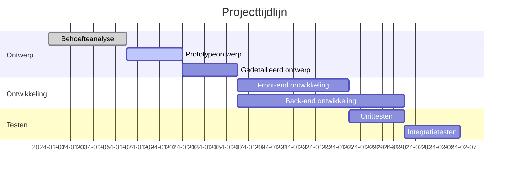
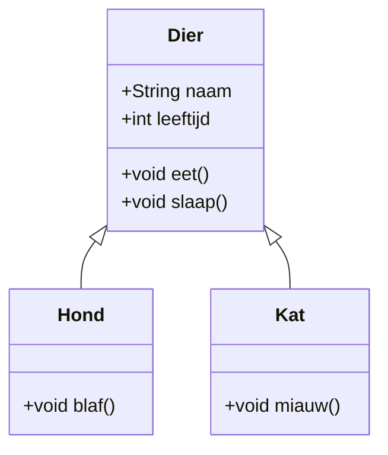
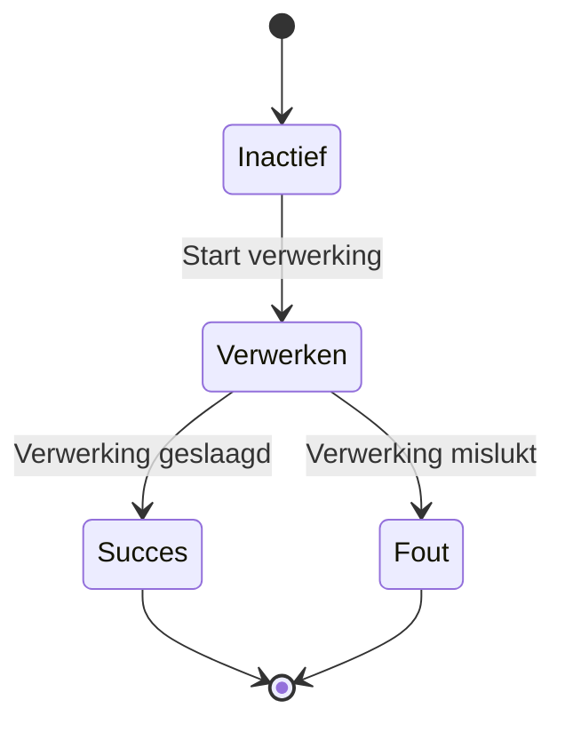
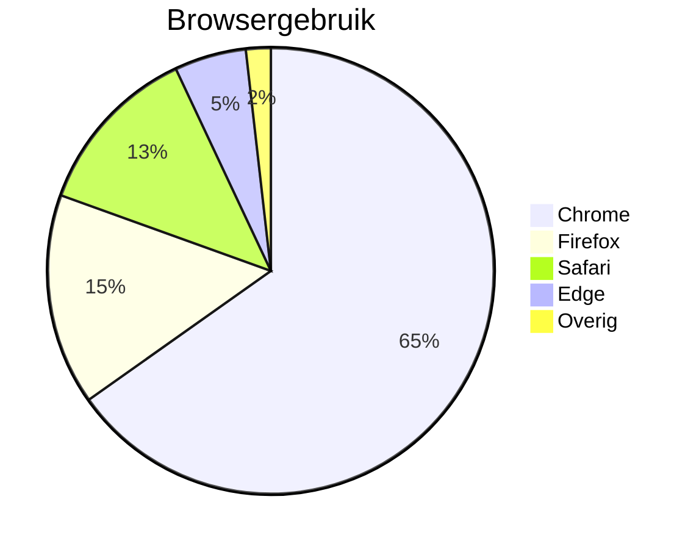

# Mermaid-diagrammentest

Dit is een testbestand om de weergavefunctionaliteit van Mermaid-diagrammen in CZON te valideren.

## Voorbeeld stroomdiagram



## Voorbeeld sequentiediagram



## Voorbeeld Gantt-diagram



## Voorbeeld klassendiagram



## Voorbeeld toestandsdiagram



## Voorbeeld taartdiagram



## Foutieve syntaxis test (moet een foutmelding tonen)

```mermaid
graph TD
    A --> B
    // Hier ontbreekt een pijldefinitie
    C --> D
```

Dit testbestand bevat meerdere Mermaid-diagramtypen om te verifiëren of de Mermaid-integratie in CZON correct werkt.