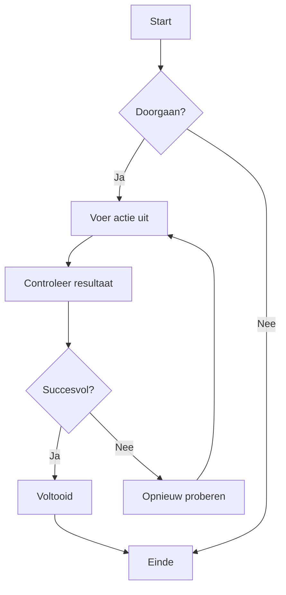
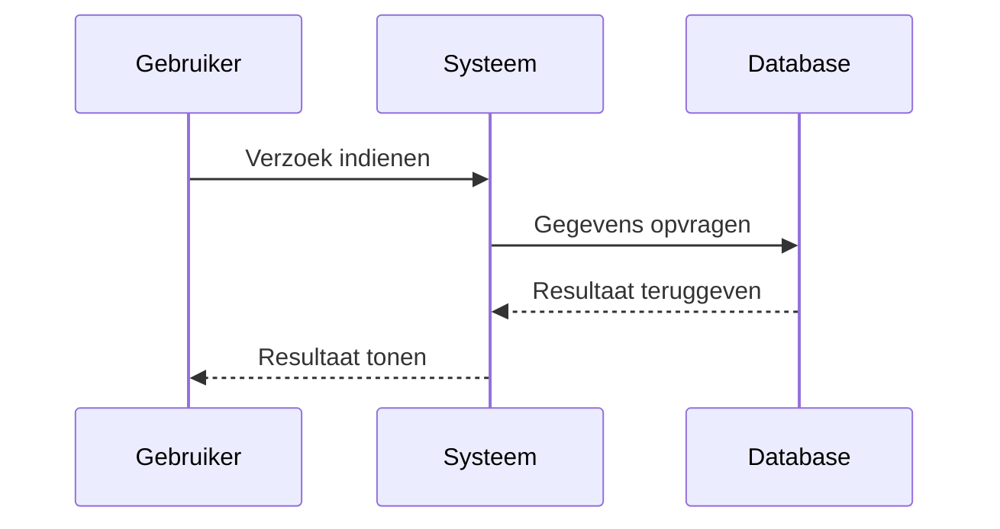
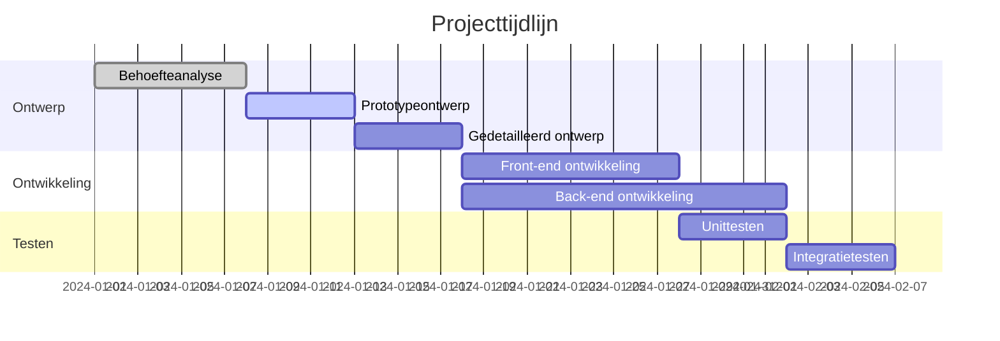
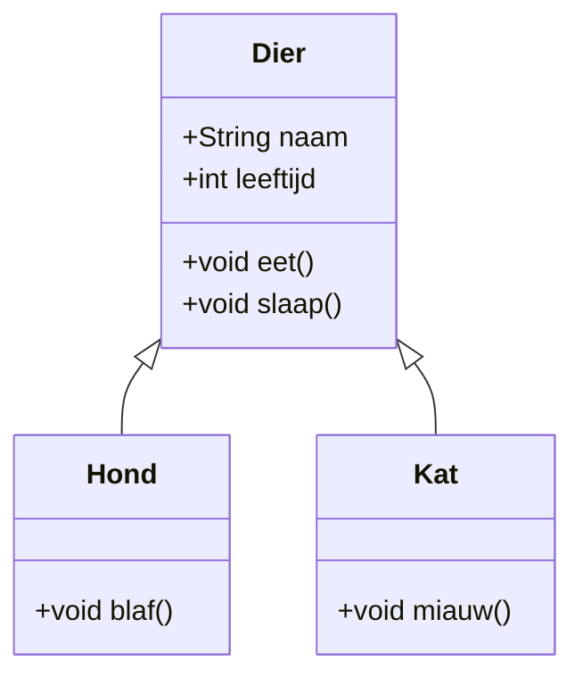
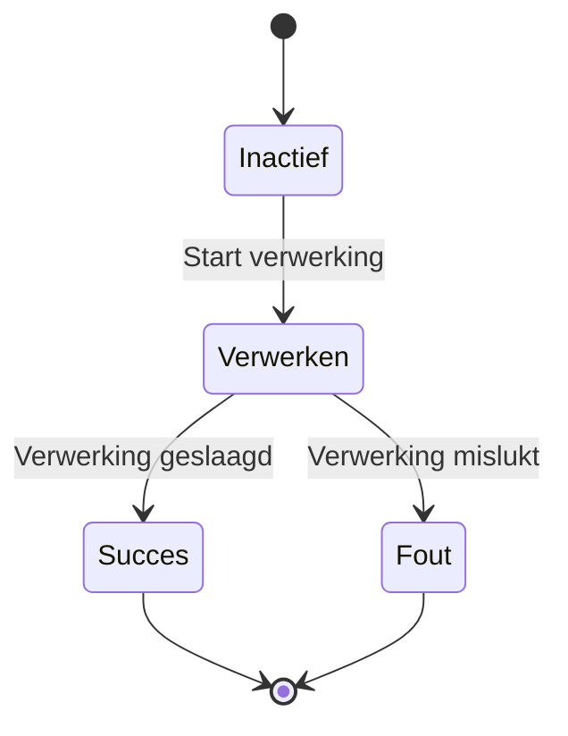
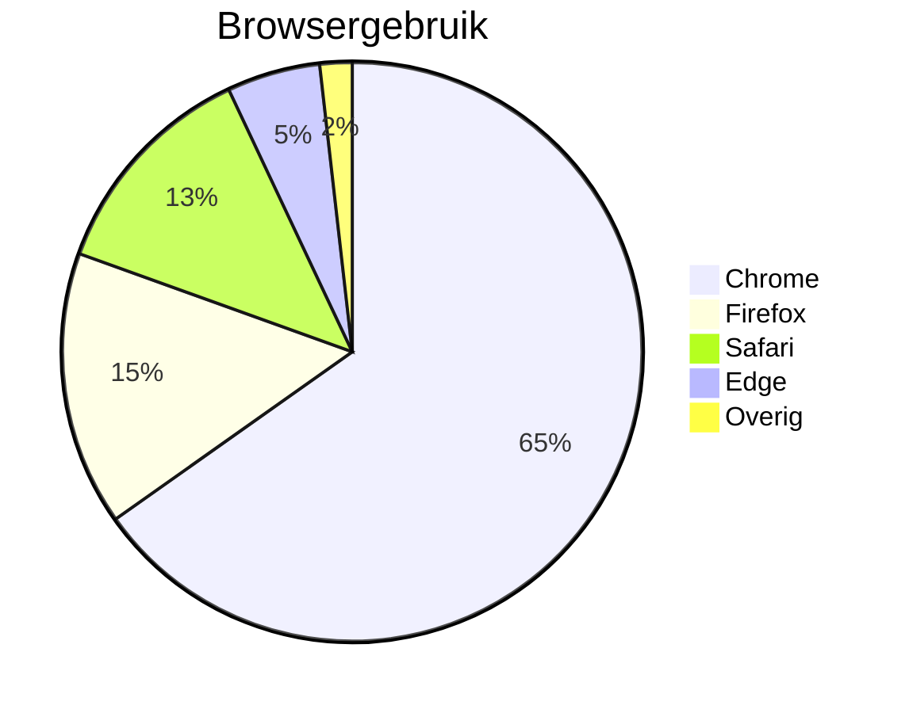

# Mermaid Diagram Test

Dit is een testbestand om de Mermaid-diagramrenderfunctionaliteit in CZON te valideren.

## Stroomdiagram Voorbeeld



## Sequentiediagram Voorbeeld



## Gantt-diagram Voorbeeld



## Klassendiagram Voorbeeld



## Toestandsdiagram Voorbeeld



## Taartdiagram Voorbeeld



## Foutieve Syntaxis Test (moet een foutmelding tonen)

```mermaid
graph TD
    A --> B
    // Hier ontbreekt een pijldefinitie
    C --> D
```

Dit testbestand bevat meerdere Mermaid-diagramtypen om te valideren of de Mermaid-integratie in CZON correct werkt.