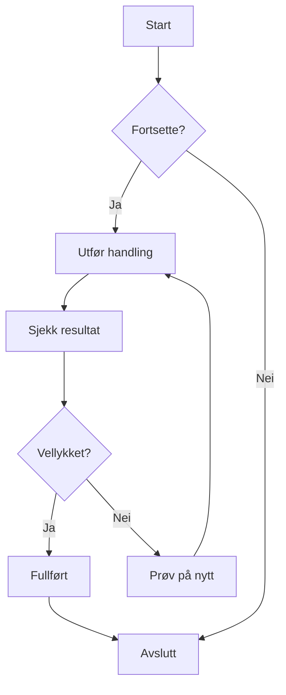
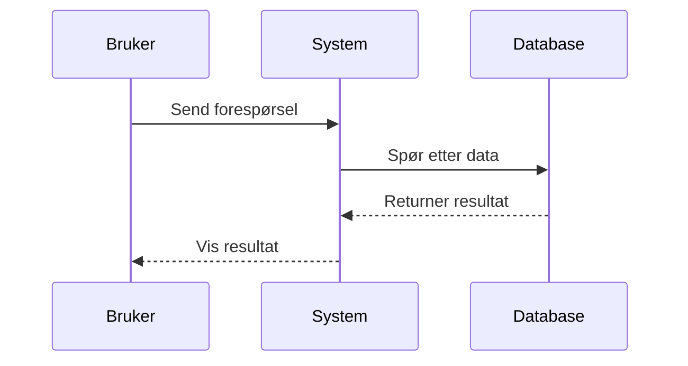
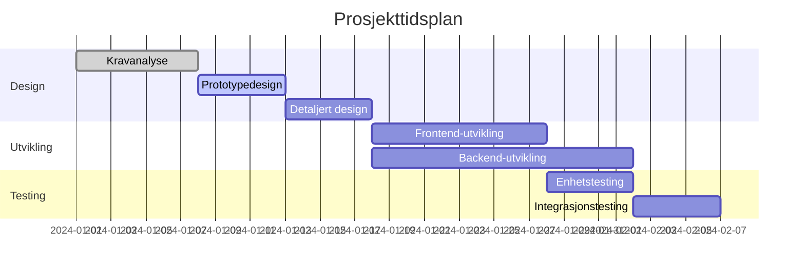
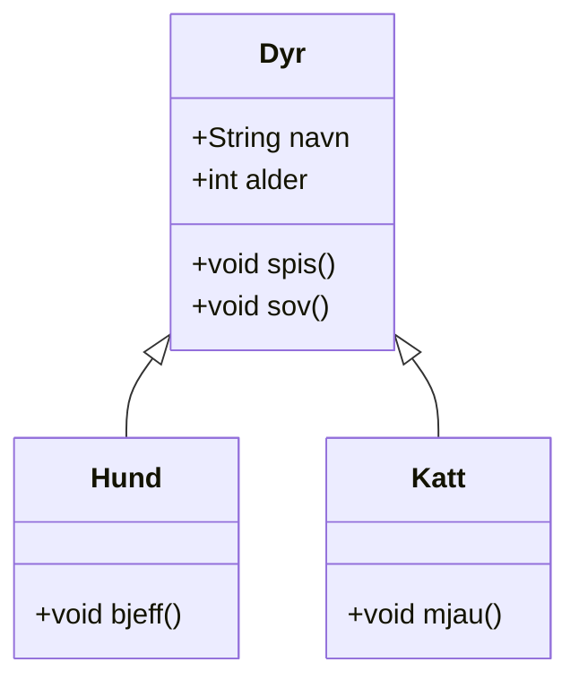
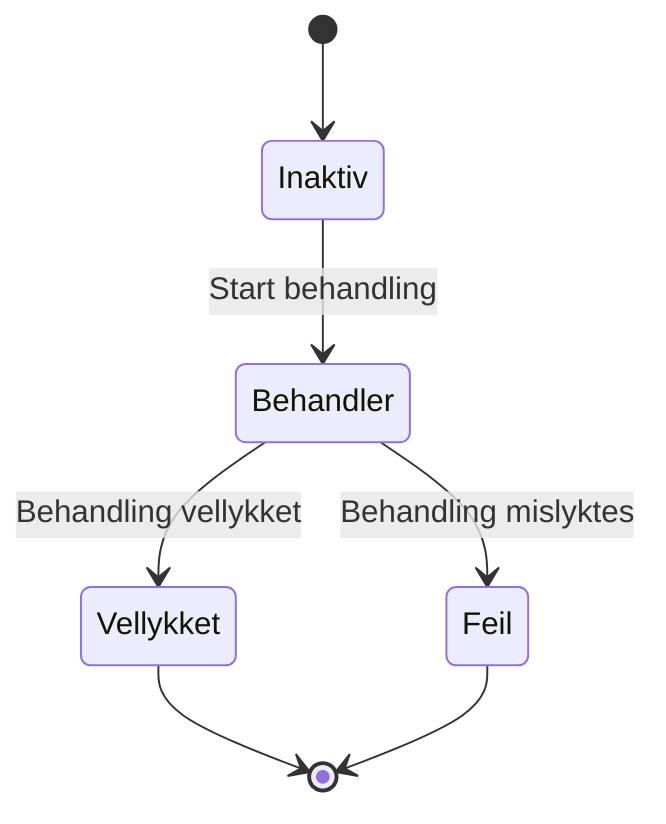
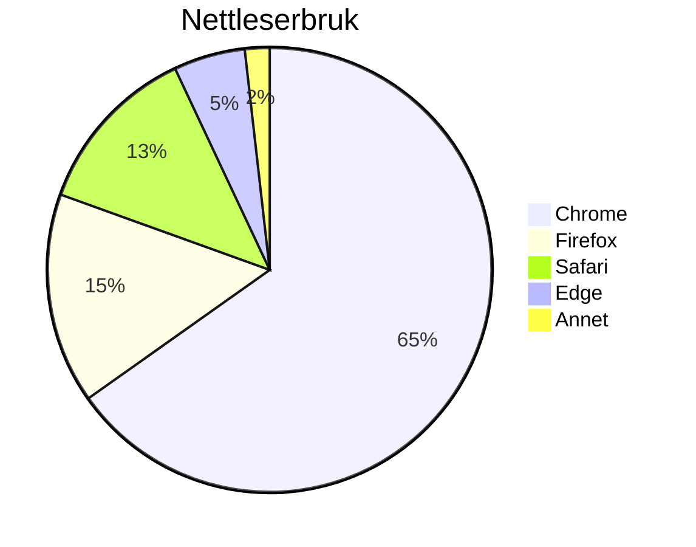

# Mermaid-diagramtest

Dette er en testfil for å verifisere Mermaid-diagramgjengivelsesfunksjonaliteten i CZON.

## Eksempel på flytskjema



## Eksempel på sekvensdiagram



## Eksempel på Gantt-diagram



## Eksempel på klassediagram



## Eksempel på tilstandsdiagram



## Eksempel på kakediagram



## Feilsyntakstest (skal vise feilmelding)

```mermaid
graph TD
    A --> B
    // Mangler pildedefinisjon her
    C --> D
```

Denne testfilen inneholder flere Mermaid-diagramtyper for å verifisere om CZONs Mermaid-integrasjon fungerer som den skal.