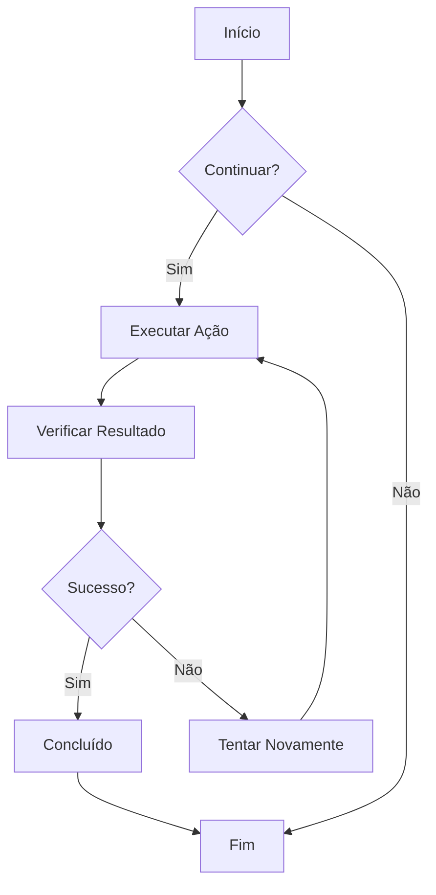
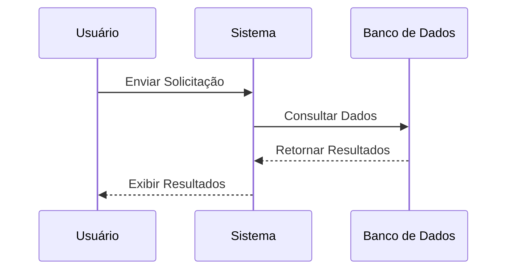
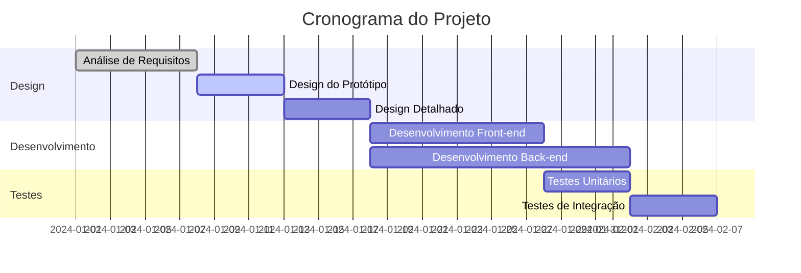
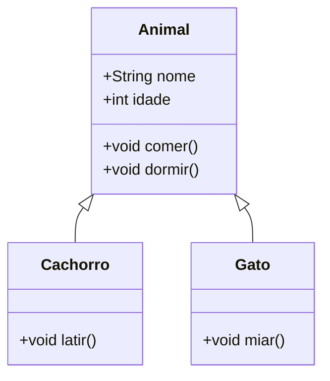
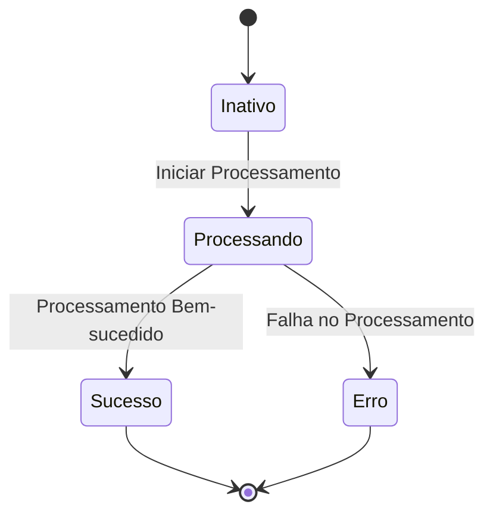
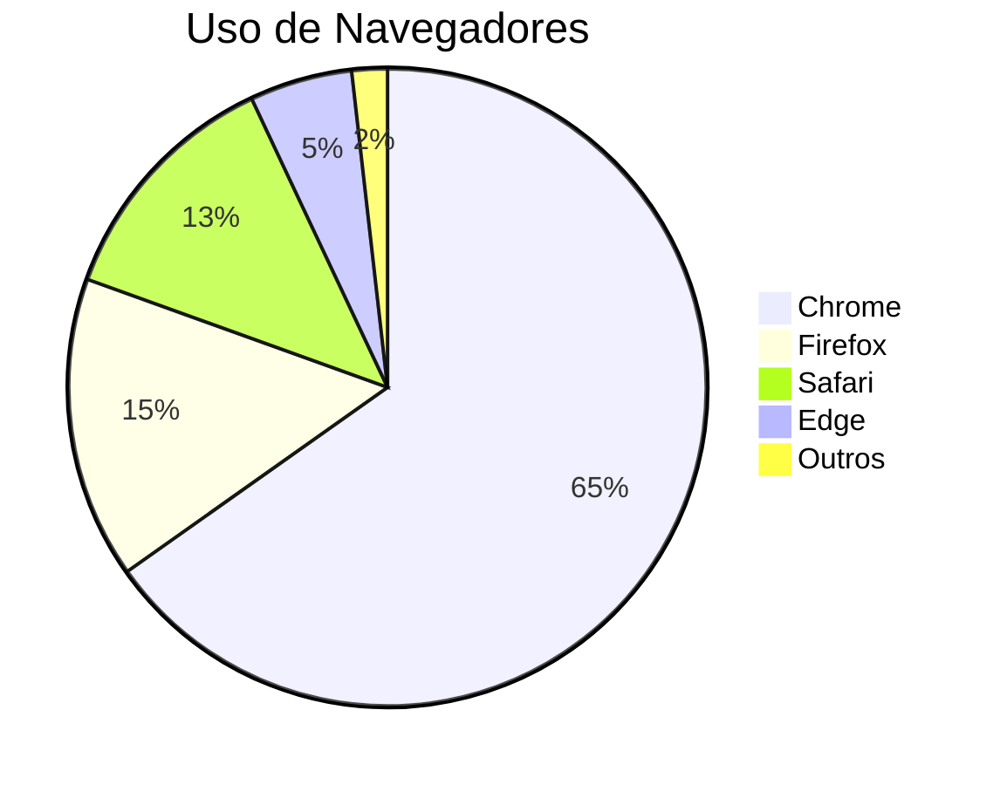

# Teste de Gráficos Mermaid

Este é um arquivo de teste para validar a funcionalidade de renderização de gráficos Mermaid no CZON.

## Exemplo de Fluxograma



## Exemplo de Diagrama de Sequência



## Exemplo de Gráfico de Gantt



## Exemplo de Diagrama de Classes



## Exemplo de Diagrama de Estado



## Exemplo de Gráfico de Pizza



## Teste de Sintaxe Incorreta (deve exibir mensagem de erro)

```mermaid
graph TD
    A --> B
    // Definição de seta ausente aqui
    C --> D
```

Este arquivo de teste inclui vários tipos de gráficos Mermaid para verificar se a integração do Mermaid no CZON está funcionando corretamente.