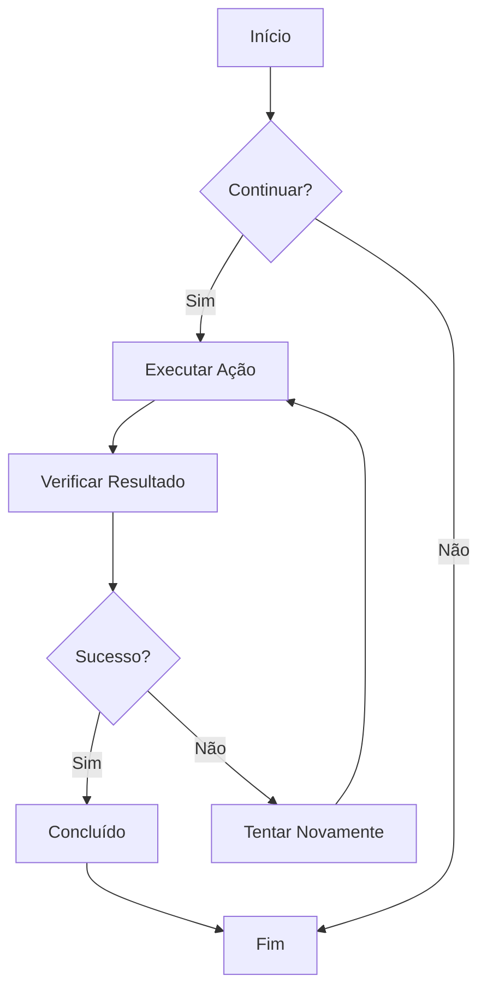
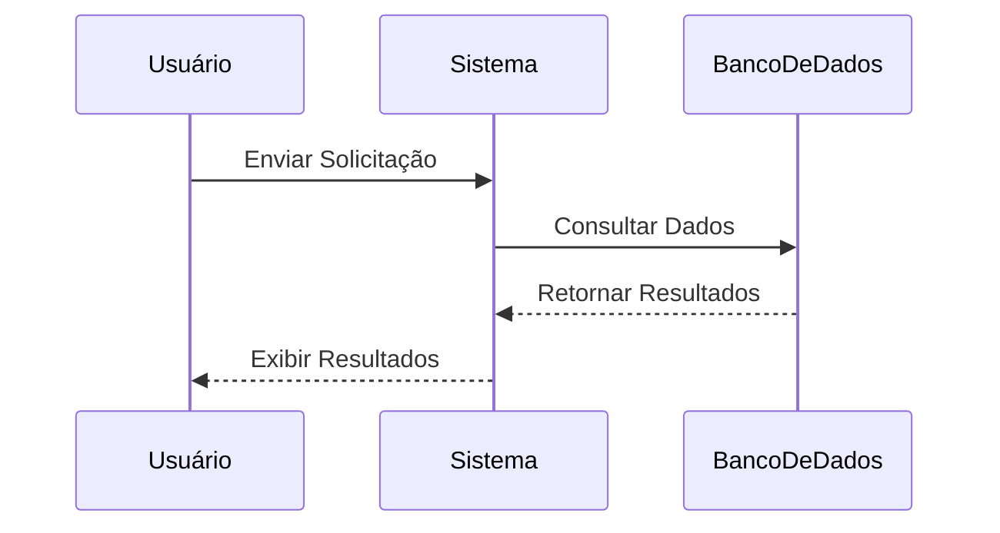
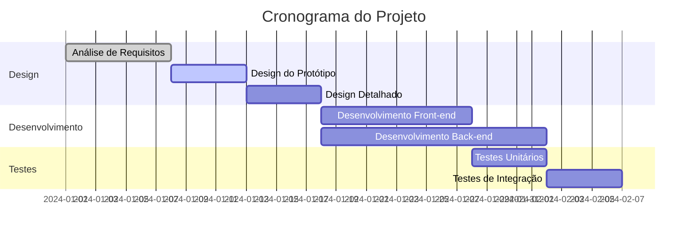
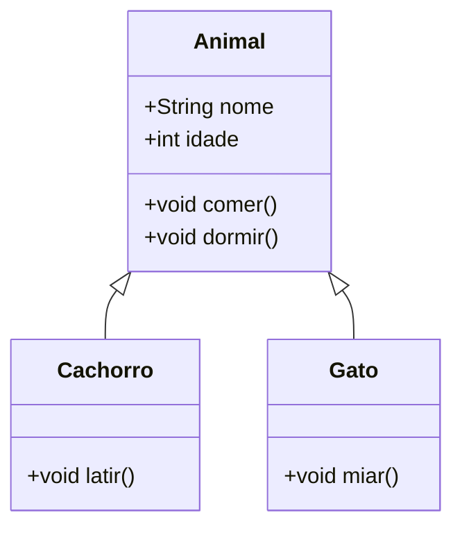
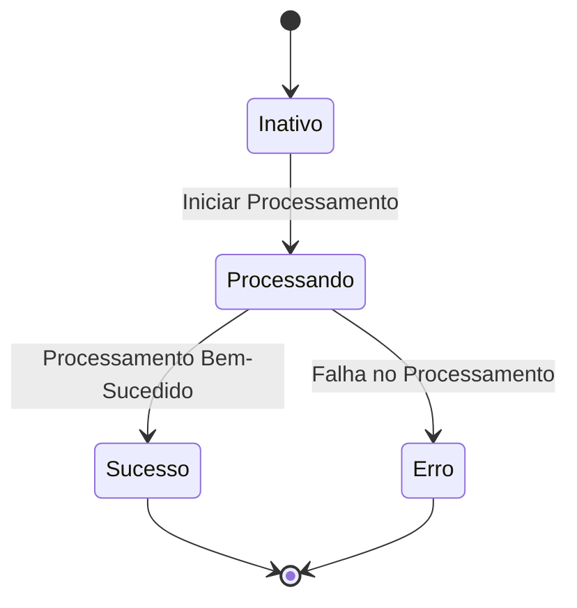
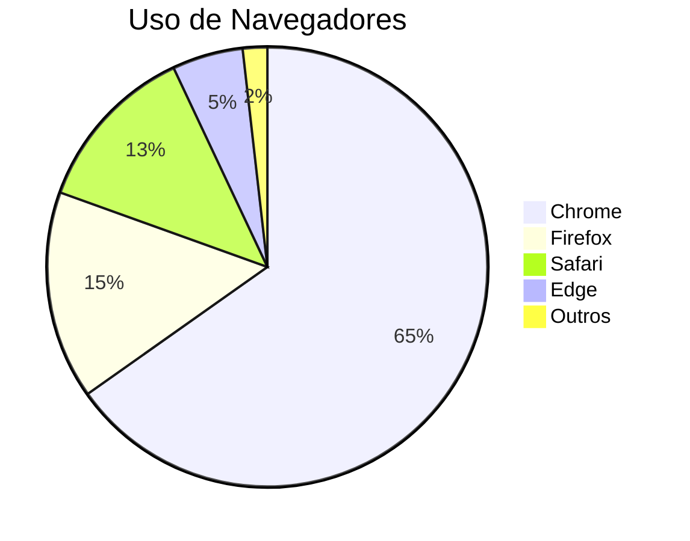

# Teste de Diagramas Mermaid

Este é um arquivo de teste para verificar a funcionalidade de renderização de diagramas Mermaid no CZON.

## Exemplo de Fluxograma



## Exemplo de Diagrama de Sequência



## Exemplo de Diagrama de Gantt



## Exemplo de Diagrama de Classes



## Exemplo de Diagrama de Estado



## Exemplo de Gráfico de Pizza



## Teste de Sintaxe Incorreta (deve exibir mensagem de erro)

```mermaid
graph TD
    A --> B
    // Falta definição da seta aqui
    C --> D
```

Este arquivo de teste contém vários tipos de diagramas Mermaid para verificar se a integração do Mermaid no CZON está funcionando corretamente.