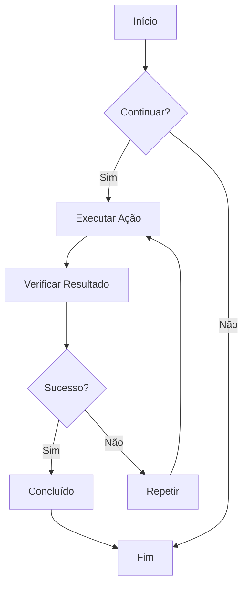
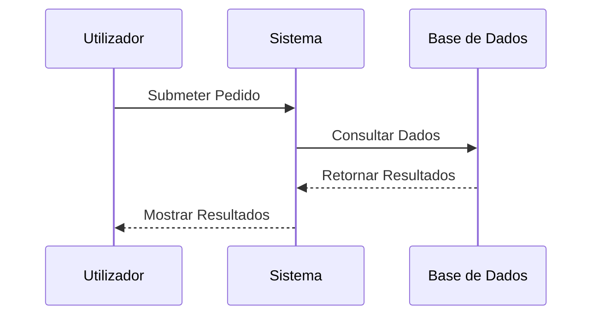
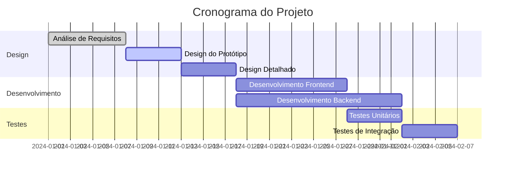
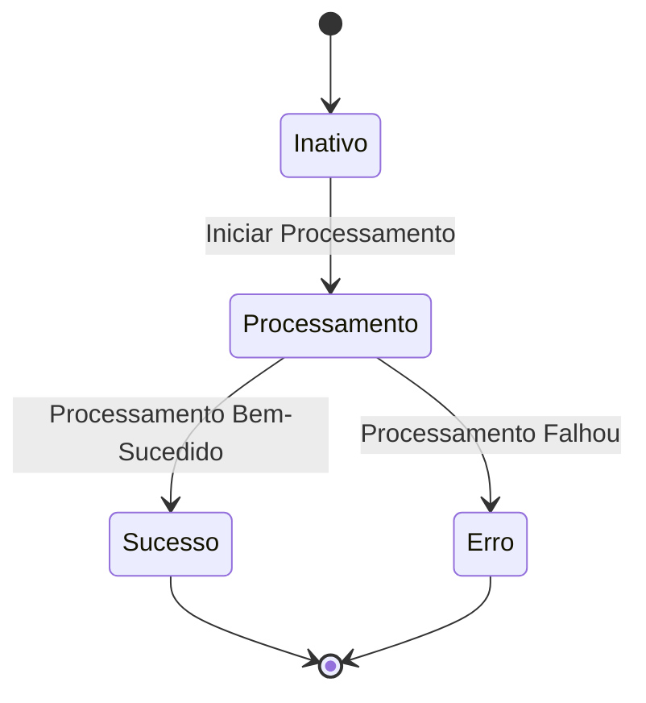
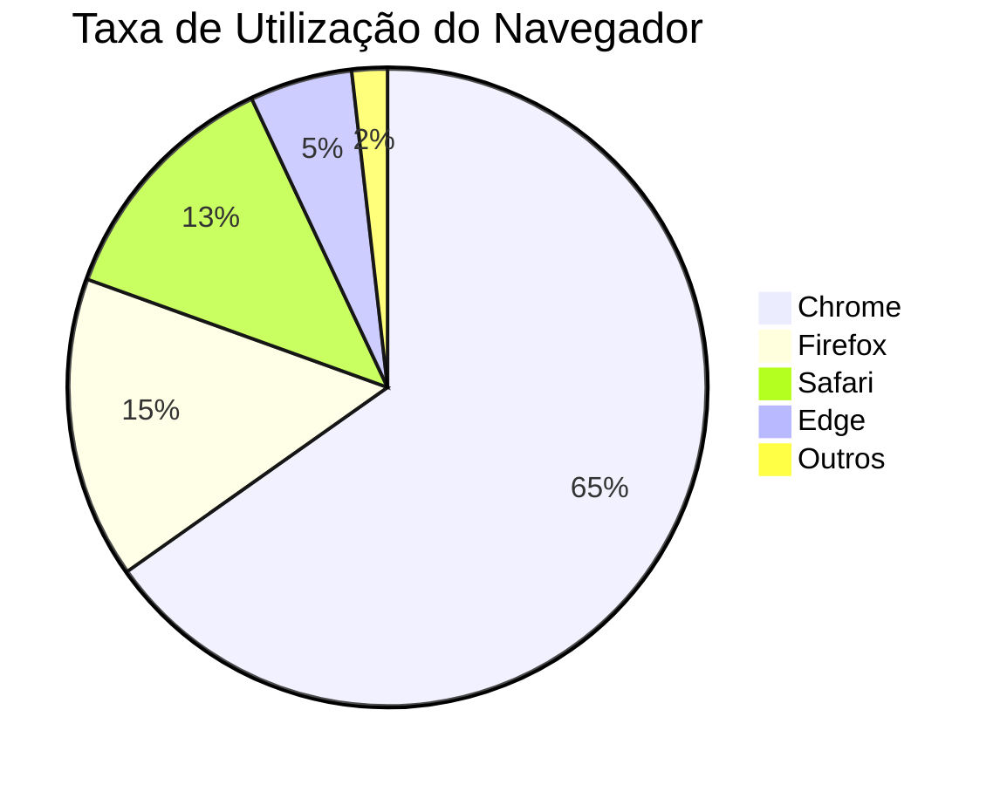

# Teste de Gráficos Mermaid

Este é um ficheiro de teste para verificar a funcionalidade de renderização de gráficos Mermaid no CZON.

## Exemplo de Fluxograma



## Exemplo de Diagrama de Sequência



## Exemplo de Diagrama de Gantt



## Exemplo de Diagrama de Classes

```mermaid
classDiagram
    class Animal {
        +String nome
        +int idade
        +void comer()
        +void dormir()
    }
    class Cão {
        +void ladrar()
    }
    class Gato {
        +void miar()
    }

    Animal <|-- Cão
    Animal <|-- Gato
```

## Exemplo de Diagrama de Estado



## Exemplo de Gráfico de Setores



## Teste de Sintaxe Incorreta (deve mostrar mensagem de erro)

```mermaid
graph TD
    A --> B
    // Falta definição da seta aqui
    C --> D
```

Este ficheiro de teste inclui vários tipos de gráficos Mermaid para verificar se a integração do CZON está a funcionar corretamente.
