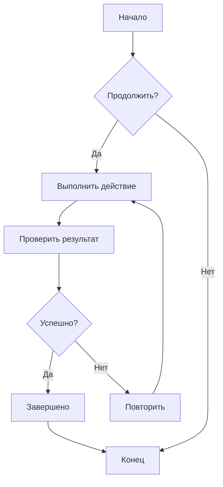
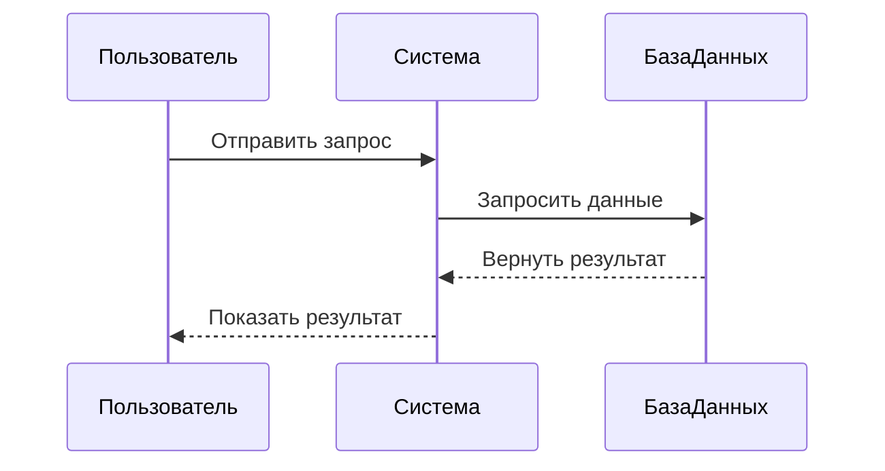
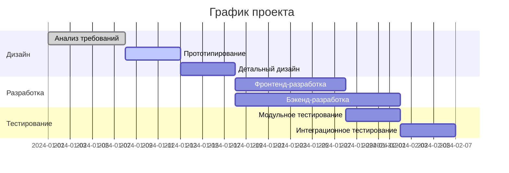
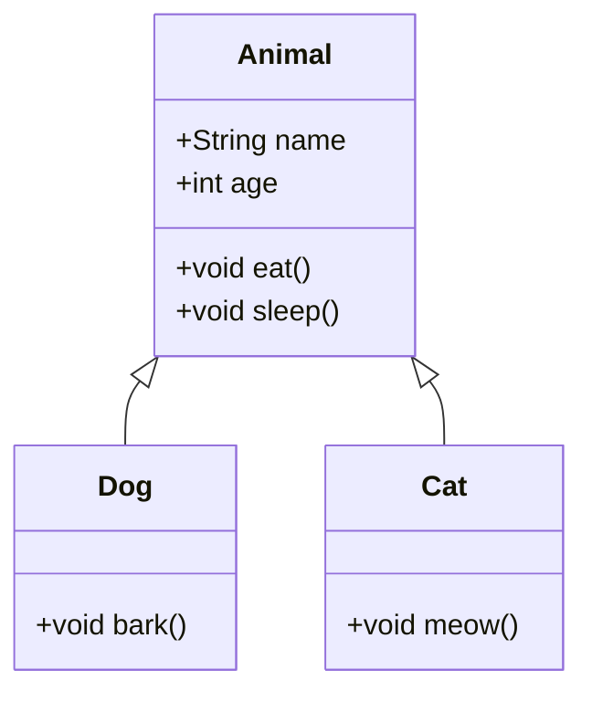
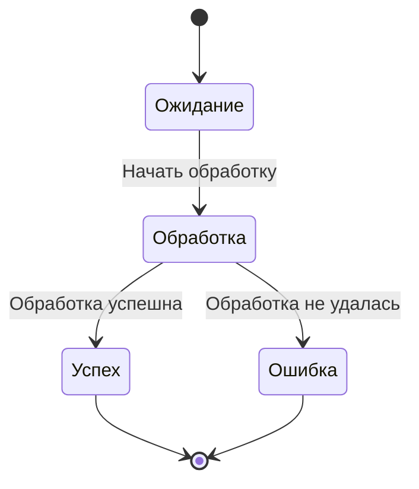
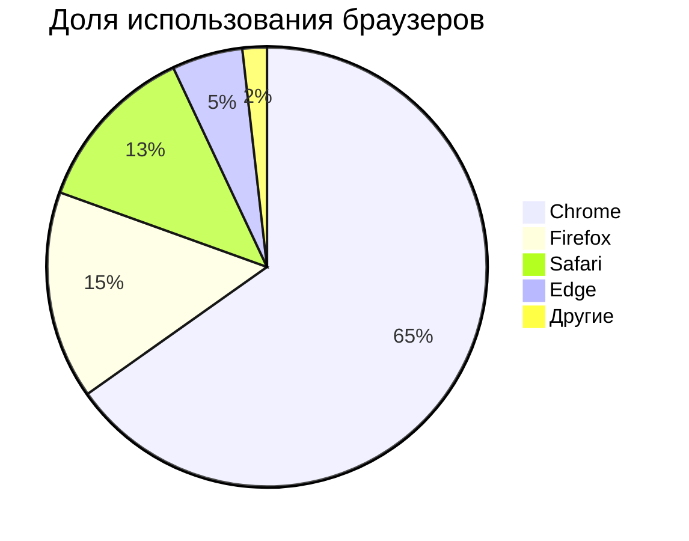

# Тестирование диаграмм Mermaid

Это тестовый файл для проверки функции рендеринга диаграмм Mermaid в CZON.

## Пример блок-схемы



## Пример диаграммы последовательностей



## Пример диаграммы Ганта



## Пример диаграммы классов



## Пример диаграммы состояний



## Пример круговой диаграммы



## Тест с ошибочным синтаксисом (должно отображаться сообщение об ошибке)

```mermaid
graph TD
    A --> B
    // Здесь отсутствует определение стрелки
    C --> D
```

Этот тестовый файл содержит различные типы диаграмм Mermaid для проверки корректной работы интеграции Mermaid в CZON.