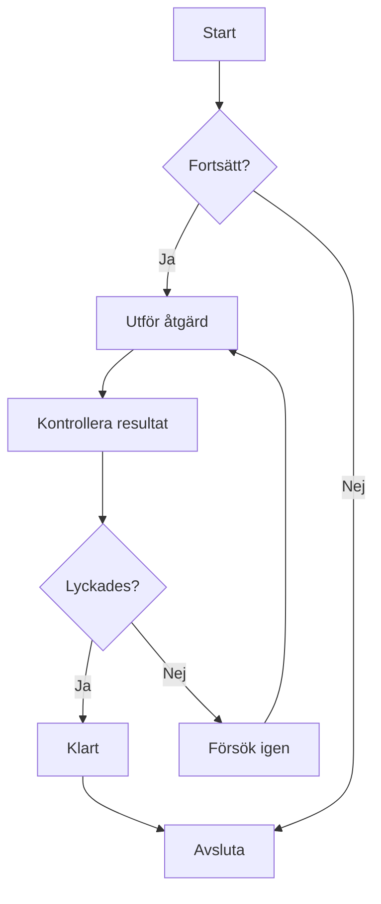
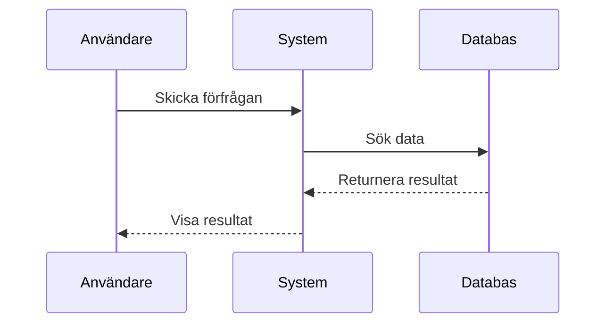
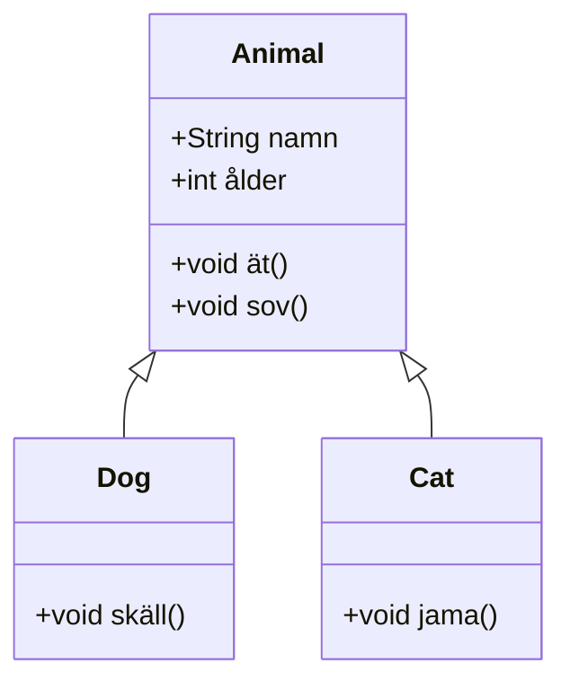
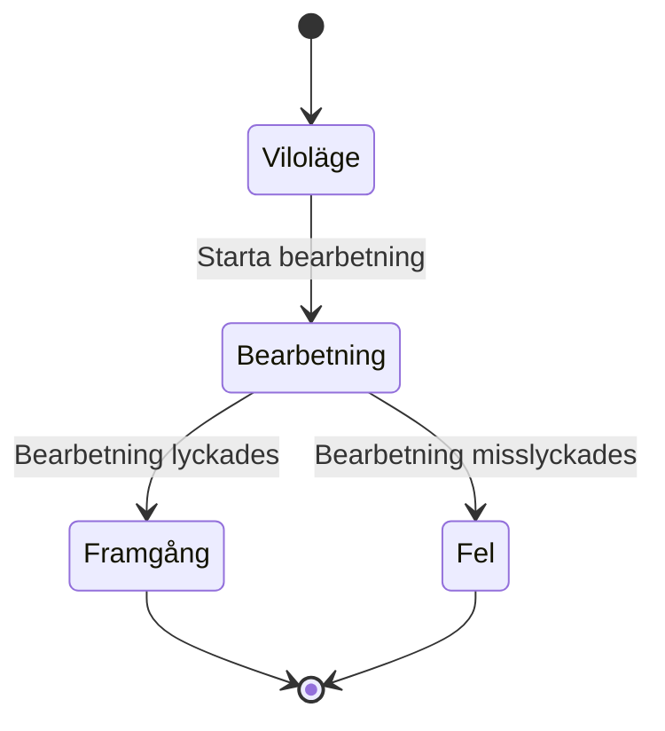
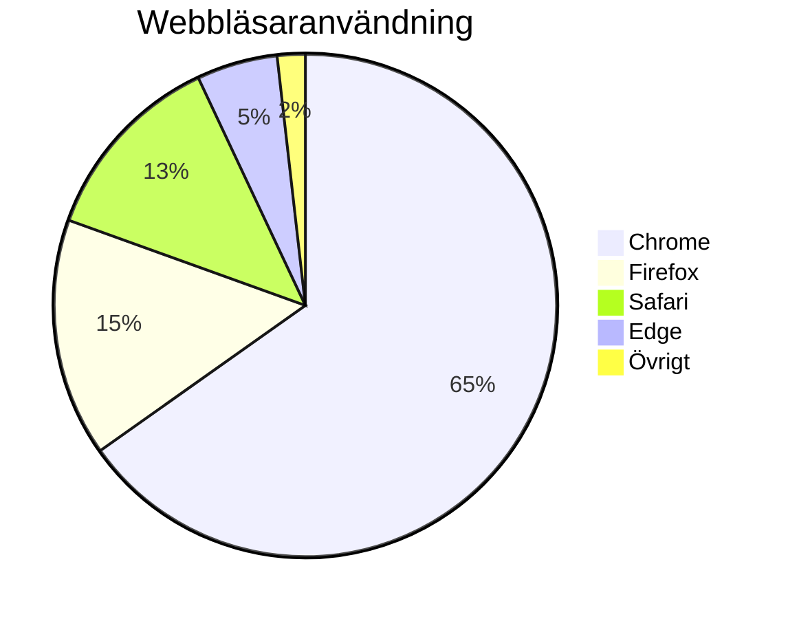

# Mermaid-diagramtest

Detta är en testfil för att validera Mermaid-diagramrendering i CZON.

## Exempel på flödesschema



## Exempel på sekvensdiagram



## Exempel på Gantt-diagram

```mermaid
gantt
    title Projektplan
    dateFormat  YYYY-MM-DD
    section Design
    Kravanalys     :klar,    des1, 2024-01-01, 7d
    Prototypdesign :aktiv,   des2, 2024-01-08, 5d
    Detaljdesign   :         des3, after des2, 5d
    section Utveckling
    Frontend-utveckling :    dev1, after des3, 10d
    Backend-utveckling  :    dev2, after des3, 15d
    section Test
    Enhetstest     :         test1, after dev1, 5d
    Integrationstest :       test2, after dev2, 5d
```

## Exempel på klassdiagram



## Exempel på tillståndsdiagram



## Exempel på cirkeldiagram



## Test av felaktig syntax (borde visa felmeddelande)

```mermaid
graph TD
    A --> B
    // Här saknas pildefinition
    C --> D
```

Denna testfil innehåller flera Mermaid-diagramtyper för att verifiera att CZON:s Mermaid-integration fungerar korrekt.