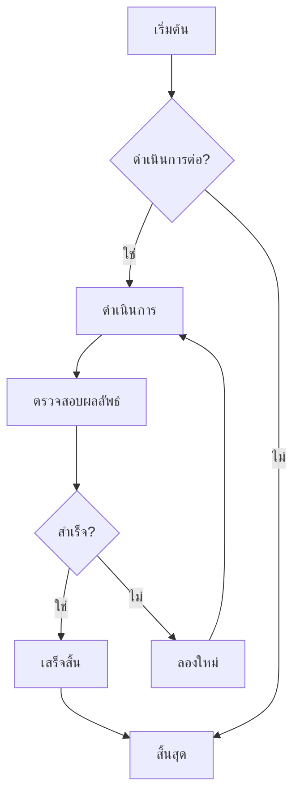
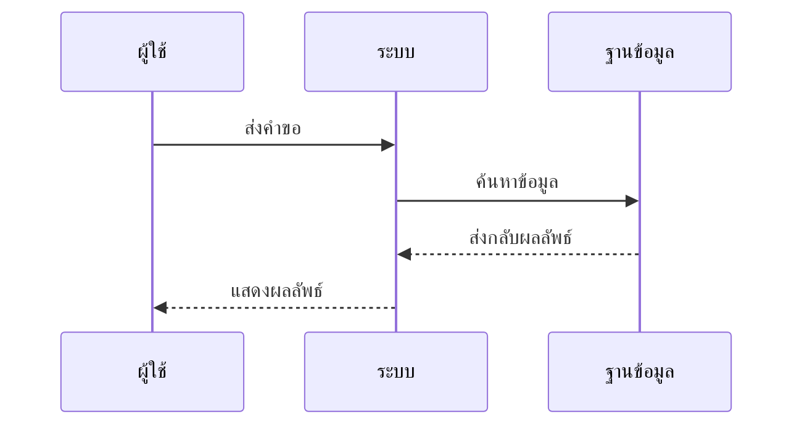
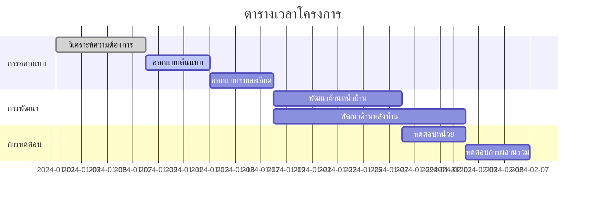
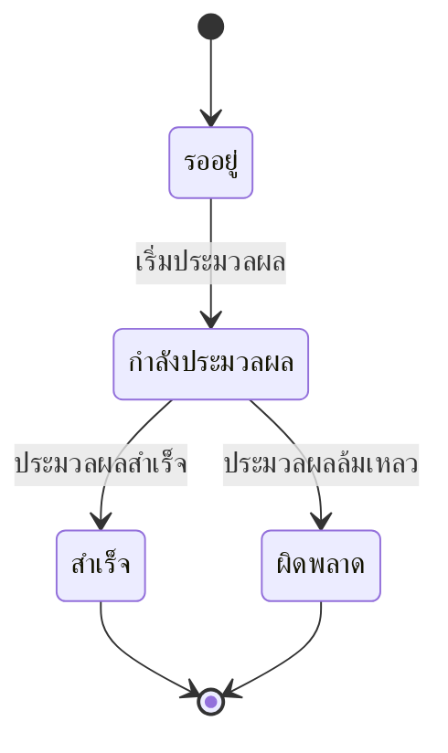
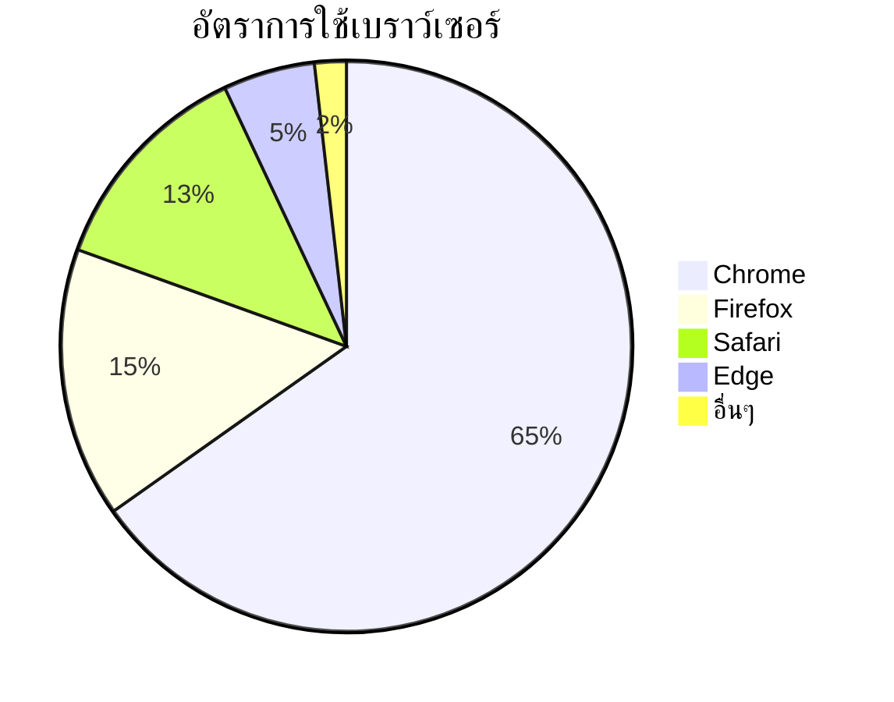

# การทดสอบแผนภูมิ Mermaid

นี่คือไฟล์ทดสอบสำหรับตรวจสอบความสามารถในการแสดงผลแผนภูมิ Mermaid ใน CZON

## ตัวอย่างแผนผังลำดับงาน



## ตัวอย่างแผนผังลำดับเวลา



## ตัวอย่างแผนภูมิแกนต์



## ตัวอย่างแผนภูมิคลาส

```mermaid
classDiagram
    class สัตว์ {
        +String ชื่อ
        +int อายุ
        +void กิน()
        +void นอน()
    }
    class สุนัข {
        +void เห่า()
    }
    class แมว {
        +void ร้อง()
    }

    สัตว์ <|-- สุนัข
    สัตว์ <|-- แมว
```

## ตัวอย่างแผนภูมิสถานะ



## ตัวอย่างแผนภูมิวงกลม



## การทดสอบไวยากรณ์ผิดพลาด (ควรแสดงข้อความผิดพลาด)

```mermaid
graph TD
    A --> B
    // ส่วนนี้ขาดคำจำกัดความลูกศร
    C --> D
```

ไฟล์ทดสอบนี้ประกอบด้วยแผนภูมิ Mermaid หลายประเภท เพื่อตรวจสอบว่าการผสานรวม Mermaid ใน CZON ทำงานได้อย่างถูกต้อง
