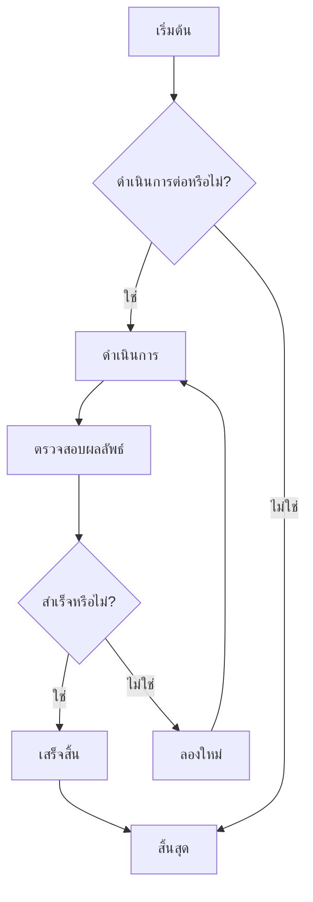
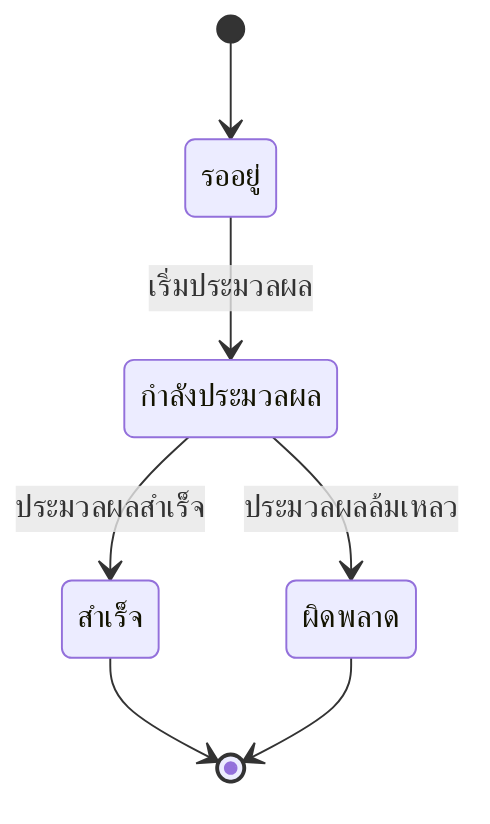
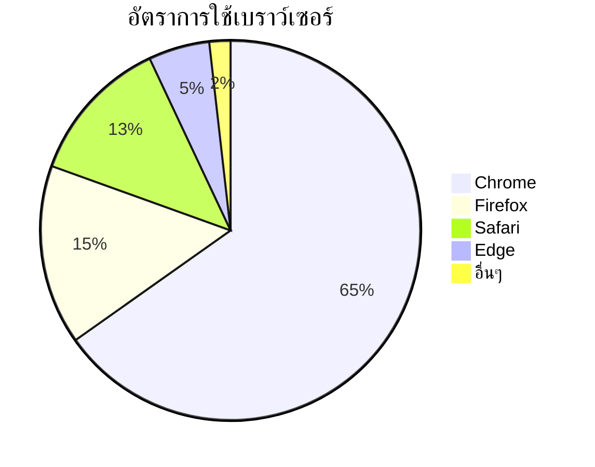

# การทดสอบไดอะแกรม Mermaid

นี่คือไฟล์ทดสอบสำหรับตรวจสอบความสามารถในการแสดงผลไดอะแกรม Mermaid ใน CZON

## ตัวอย่างโฟลว์ชาร์ต



## ตัวอย่างไดอะแกรมลำดับขั้นตอน


## ตัวอย่างแกนต์ชาร์ต

```mermaid
gantt
    title ตารางเวลาโครงการ
    dateFormat  YYYY-MM-DD
    section การออกแบบ
    วิเคราะห์ความต้องการ     :เสร็จแล้ว,    des1, 2024-01-01, 7d
    ออกแบบต้นแบบ     :กำลังดำเนินการ,  des2, 2024-01-08, 5d
    ออกแบบรายละเอียด     :         des3, after des2, 5d
    section การพัฒนา
    พัฒนาด้านหน้าบ้าน     :         dev1, after des3, 10d
    พัฒนาด้านหลังบ้าน     :         dev2, after des3, 15d
    section การทดสอบ
    ทดสอบหน่วย     :         test1, after dev1, 5d
    ทดสอบบูรณาการ     :         test2, after dev2, 5d
```

## ตัวอย่างไดอะแกรมคลาส

```mermaid
classDiagram
    class สัตว์ {
        +String ชื่อ
        +int อายุ
        +void กิน()
        +void นอน()
    }
    class สุนัข {
        +void เห่า()
    }
    class แมว {
        +void ร้อง()
    }

    สัตว์ <|-- สุนัข
    สัตว์ <|-- แมว
```

## ตัวอย่างไดอะแกรมสถานะ



## ตัวอย่างแผนภูมิวงกลม



## การทดสอบไวยากรณ์ผิดพลาด (ควรแสดงข้อความผิดพลาด)

```mermaid
graph TD
    A --> B
    // ขาดการกำหนดลูกศรที่นี่
    C --> D
```

ไฟล์ทดสอบนี้ประกอบด้วยไดอะแกรม Mermaid หลายประเภท เพื่อตรวจสอบว่าการผสานรวม Mermaid ใน CZON ทำงานได้อย่างถูกต้องหรือไม่