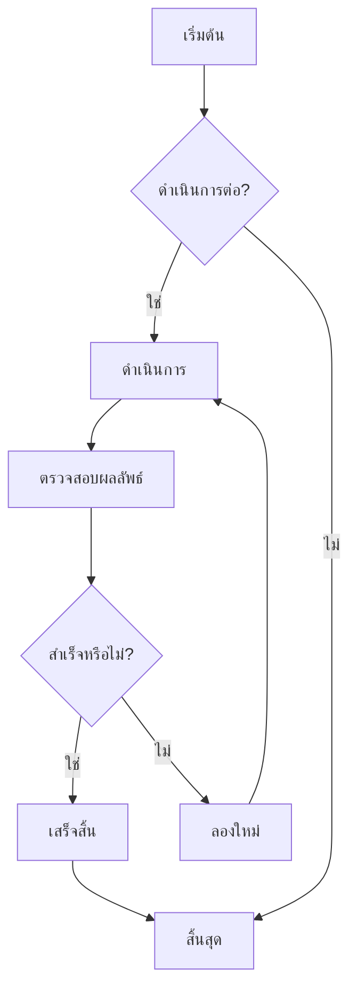
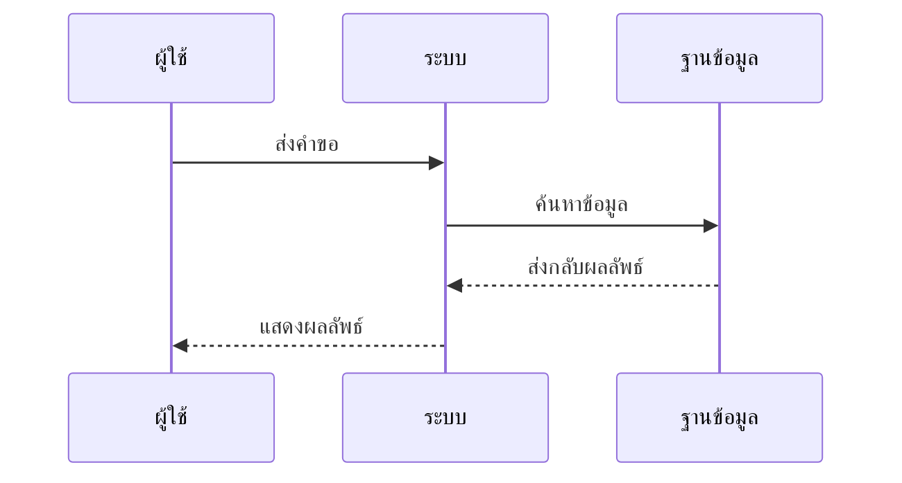
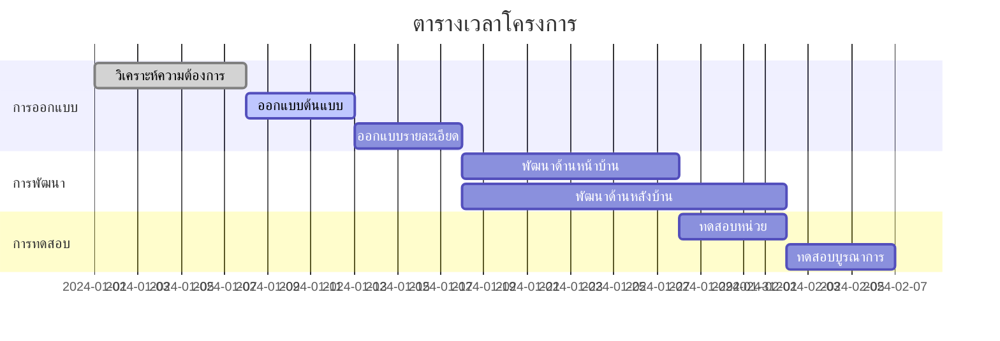
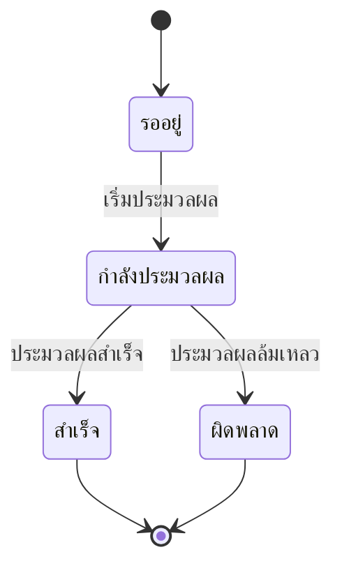
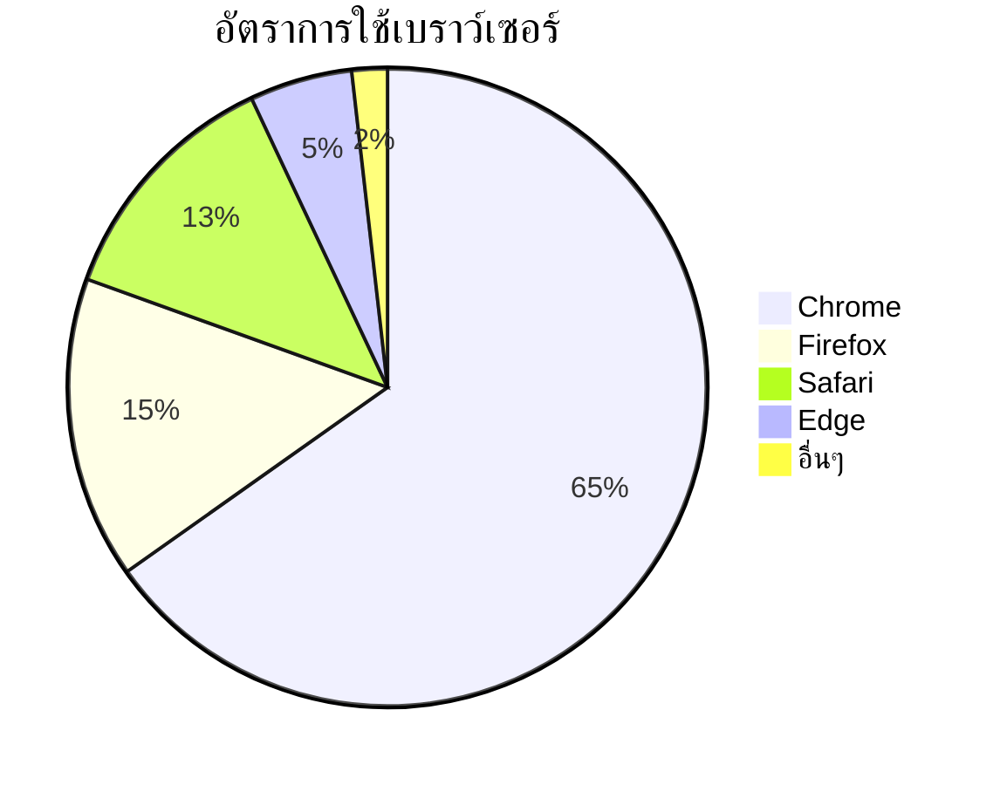

# การทดสอบไดอะแกรม Mermaid

นี่คือไฟล์ทดสอบสำหรับตรวจสอบฟังก์ชันการแสดงผลไดอะแกรม Mermaid ใน CZON

## ตัวอย่างแผนผังลำดับงาน (Flowchart)



## ตัวอย่างแผนผังลำดับเหตุการณ์ (Sequence Diagram)



## ตัวอย่างแผนภูมิแกนต์ (Gantt Chart)



## ตัวอย่างแผนภาพคลาส (Class Diagram)

```mermaid
classDiagram
    class สัตว์ {
        +String ชื่อ
        +int อายุ
        +void กิน()
        +void นอน()
    }
    class สุนัข {
        +void เห่า()
    }
    class แมว {
        +void ร้อง()
    }

    สัตว์ <|-- สุนัข
    สัตว์ <|-- แมว
```

## ตัวอย่างแผนภาพสถานะ (State Diagram)



## ตัวอย่างแผนภูมิวงกลม (Pie Chart)



## การทดสอบไวยากรณ์ผิดพลาด (ควรแสดงข้อความผิดพลาด)

```mermaid
graph TD
    A --> B
    // ส่วนนี้ขาดการกำหนดลูกศร
    C --> D
```

ไฟล์ทดสอบนี้ประกอบด้วยไดอะแกรม Mermaid หลายประเภท เพื่อตรวจสอบว่าการผสานรวม Mermaid ใน CZON ทำงานได้ปกติหรือไม่