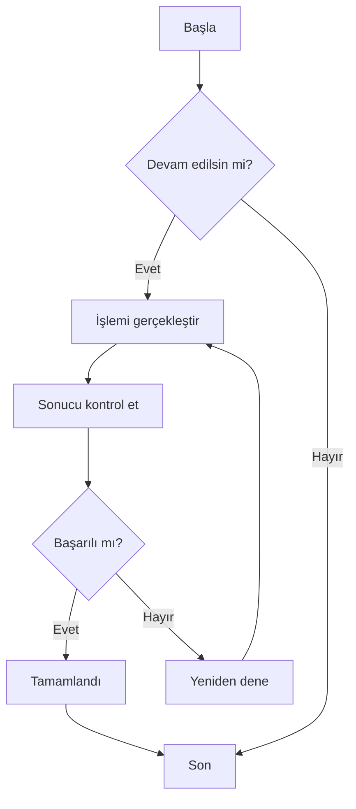
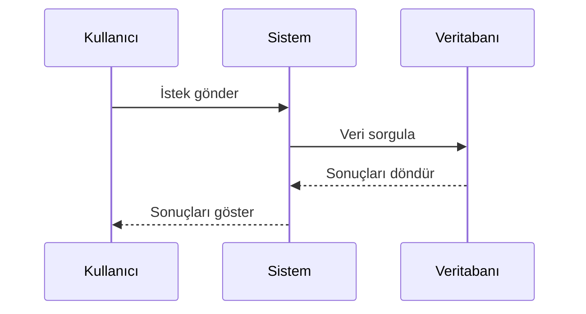
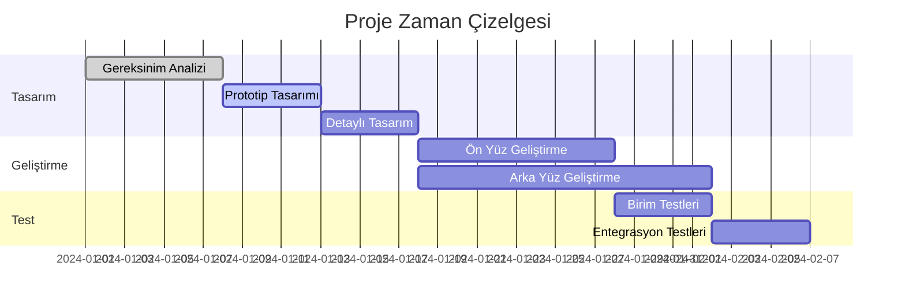
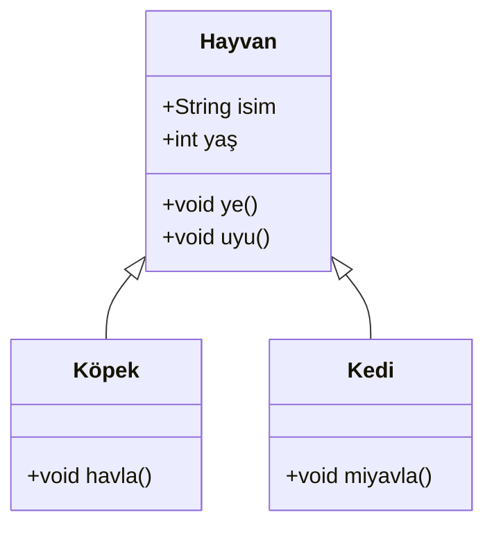
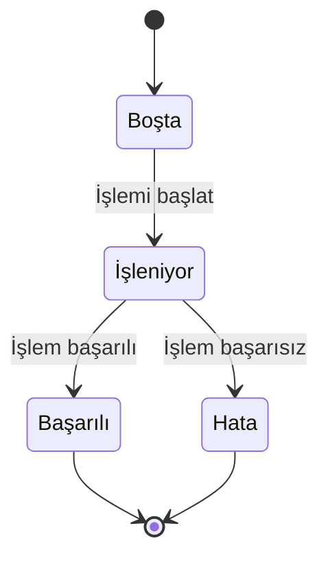
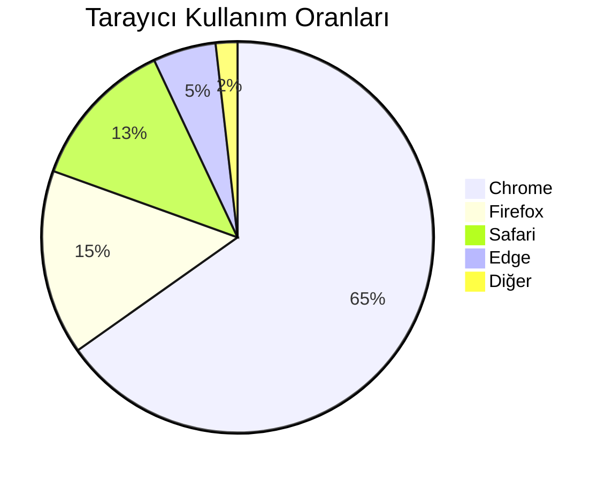

# Mermaid Grafik Testi

Bu, CZON'daki Mermaid grafik oluşturma işlevini doğrulamak için kullanılan bir test dosyasıdır.

## Akış Şeması Örneği



## Sıralama Diyagramı Örneği



## Gantt Şeması Örneği



## Sınıf Diyagramı Örneği



## Durum Diyagramı Örneği



## Pasta Grafiği Örneği



## Hatalı Sözdizimi Testi (hata mesajı göstermeli)

```mermaid
graph TD
    A --> B
    // Burada ok tanımı eksik
    C --> D
```

Bu test dosyası, CZON'un Mermaid entegrasyonunun düzgün çalışıp çalışmadığını doğrulamak için çeşitli Mermaid grafik türlerini içerir.