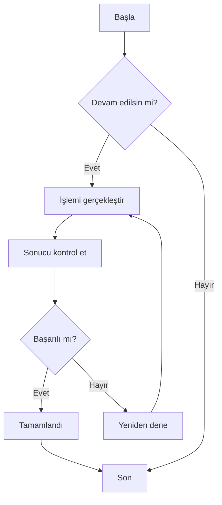
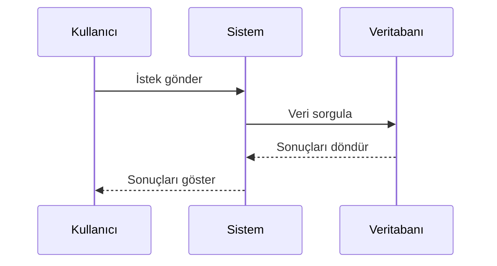
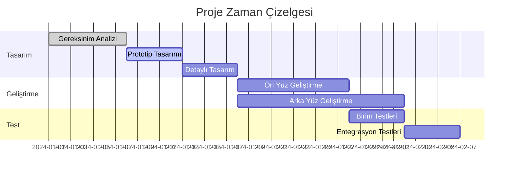
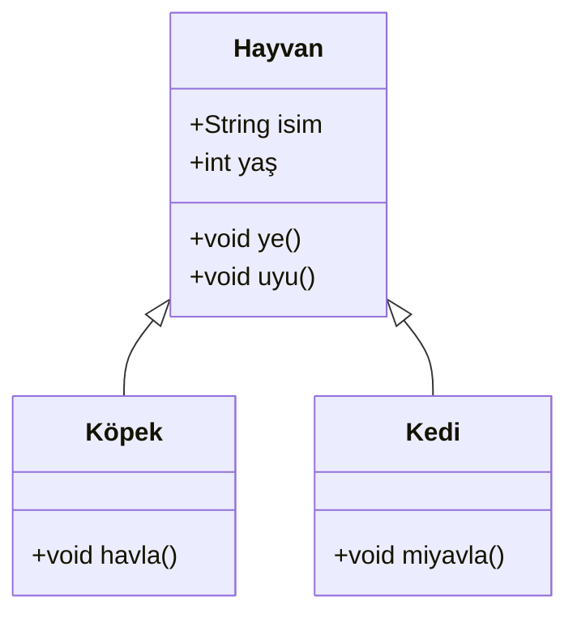
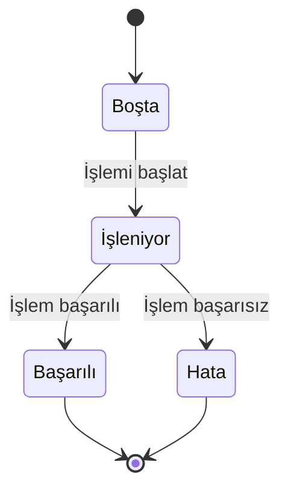
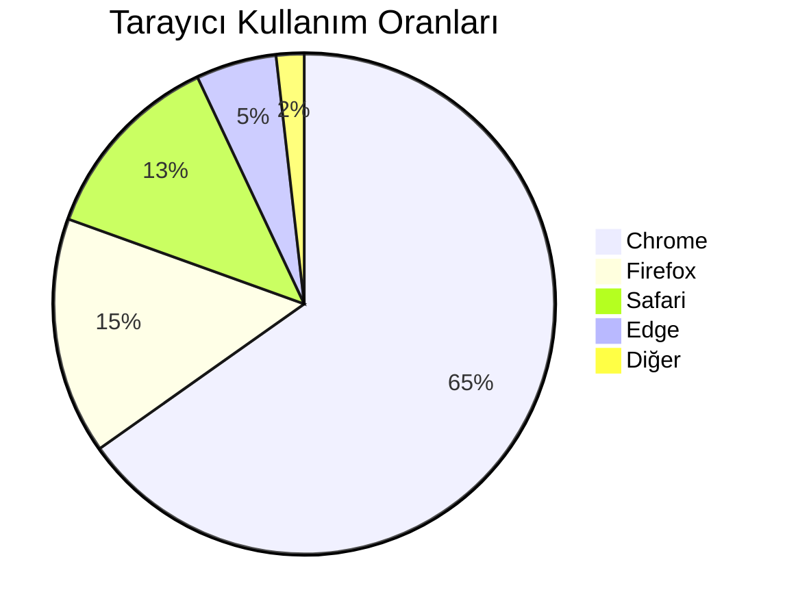

# Mermaid Diyagram Testi

Bu, CZON'daki Mermaid diyagram oluşturma işlevini doğrulamak için bir test dosyasıdır.

## Akış Şeması Örneği



## Sıralı Diyagram Örneği



## Gantt Şeması Örneği



## Sınıf Diyagramı Örneği



## Durum Diyagramı Örneği



## Pasta Grafik Örneği



## Hatalı Sözdizimi Testi (hata mesajı göstermeli)

```mermaid
graph TD
    A --> B
    // Burada ok tanımı eksik
    C --> D
```

Bu test dosyası, CZON'un Mermaid entegrasyonunun düzgün çalışıp çalışmadığını doğrulamak için çeşitli Mermaid diyagram türlerini içermektedir.
