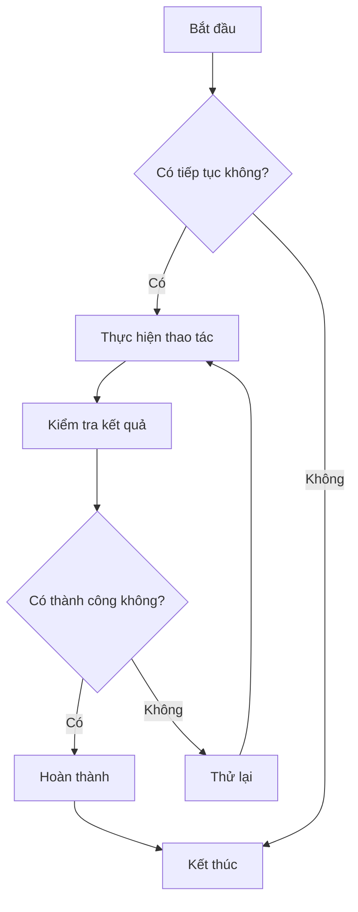
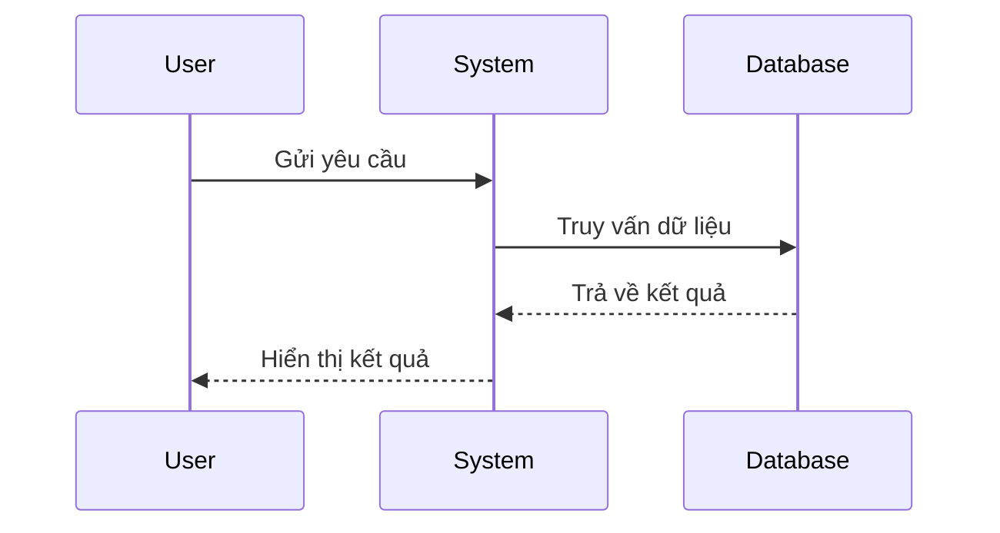
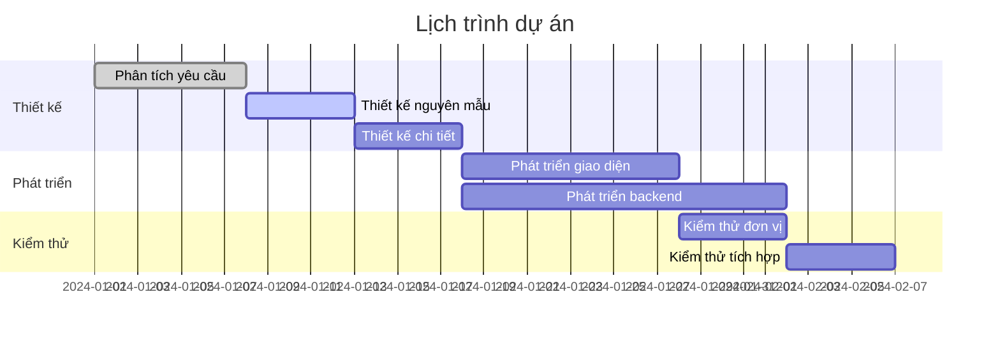
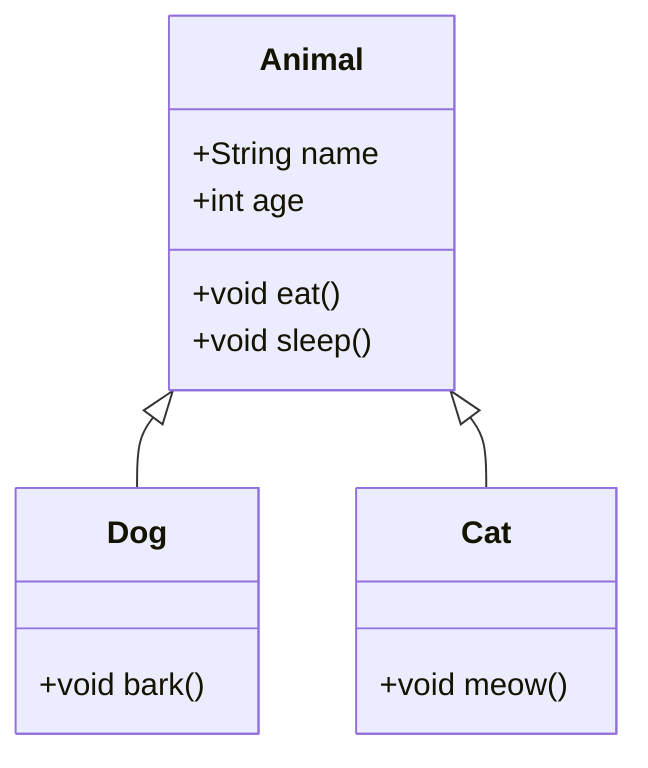
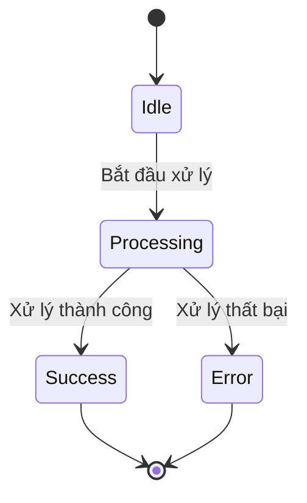
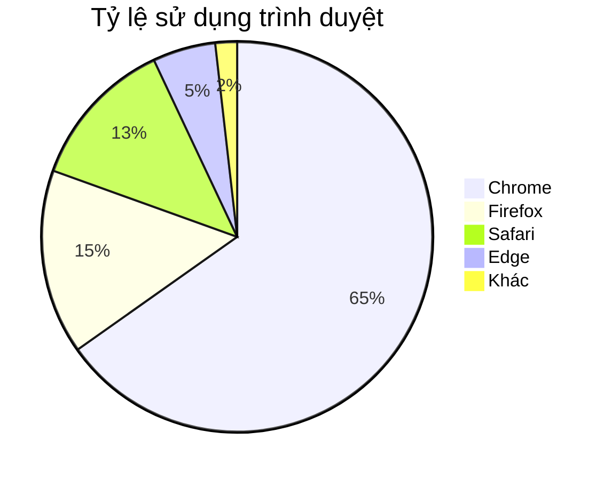

# Kiểm tra biểu đồ Mermaid

Đây là một tập tin kiểm tra, dùng để xác minh chức năng hiển thị biểu đồ Mermaid trong CZON.

## Ví dụ về lưu đồ



## Ví dụ về biểu đồ tuần tự



## Ví dụ về biểu đồ Gantt



## Ví dụ về biểu đồ lớp



## Ví dụ về biểu đồ trạng thái



## Ví dụ về biểu đồ tròn



## Kiểm tra cú pháp lỗi (nên hiển thị thông báo lỗi)

```mermaid
graph TD
    A --> B
    // Thiếu định nghĩa mũi tên ở đây
    C --> D
```

Tập tin kiểm tra này bao gồm nhiều loại biểu đồ Mermaid, dùng để xác minh tích hợp Mermaid trong CZON có hoạt động bình thường hay không.