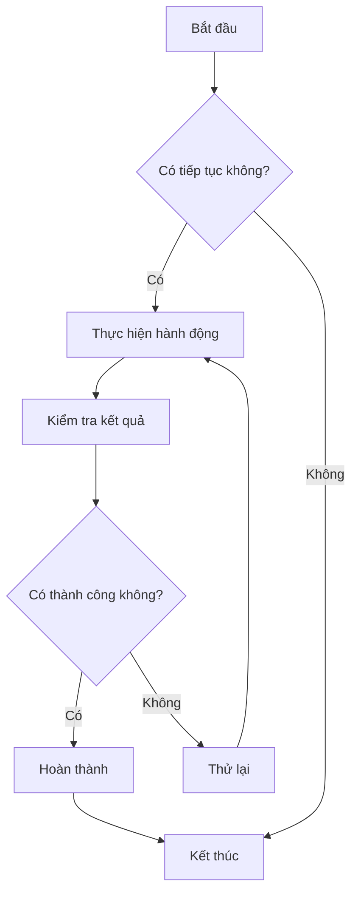
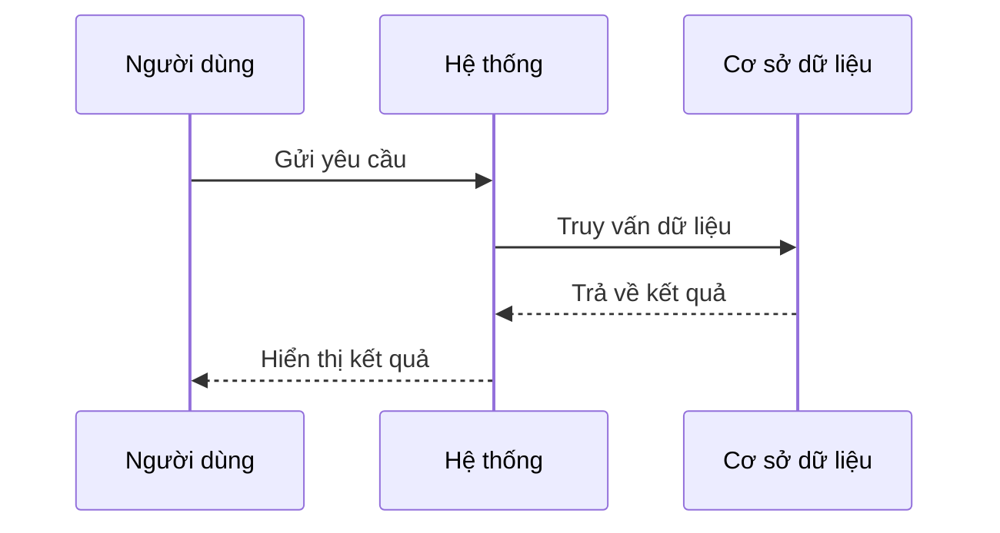

# Kiểm tra Biểu đồ Mermaid

Đây là một tệp kiểm tra để xác minh chức năng hiển thị biểu đồ Mermaid trong CZON.

## Ví dụ về Lưu đồ



## Ví dụ về Biểu đồ Tuần tự



## Ví dụ về Biểu đồ Gantt


## Ví dụ về Biểu đồ Lớp


## Ví dụ về Biểu đồ Trạng thái


## Ví dụ về Biểu đồ Tròn


## Kiểm tra Cú pháp Lỗi (nên hiển thị thông báo lỗi)

```mermaid
graph TD
    A --> B
    // Thiếu định nghĩa mũi tên ở đây
    C --> D
```

Tệp kiểm tra này bao gồm nhiều loại biểu đồ Mermaid khác nhau, nhằm xác minh xem tích hợp Mermaid trong CZON có hoạt động bình thường không.
