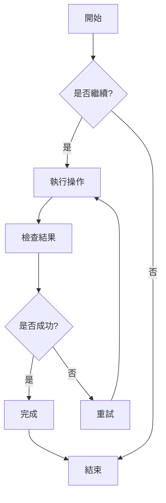
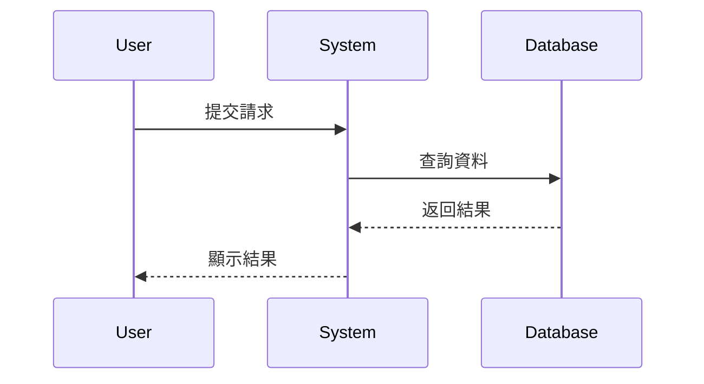
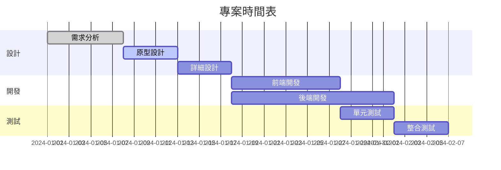
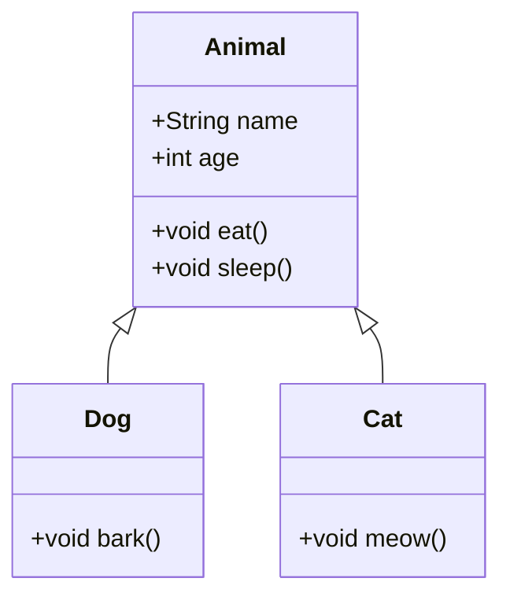
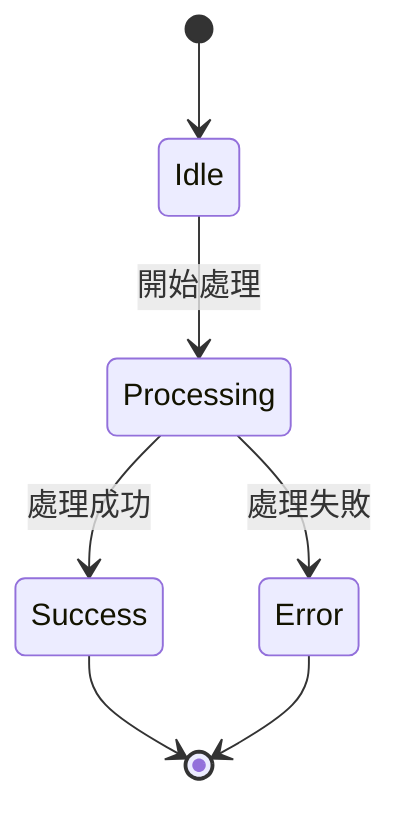
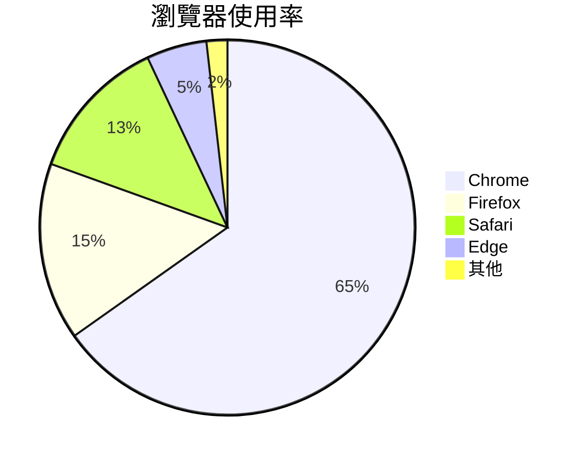

# Mermaid 圖表測試

這是一個測試文件，用於驗證 CZON 中的 Mermaid 圖表渲染功能。

## 流程圖範例



## 序列圖範例



## 甘特圖範例



## 類別圖範例



## 狀態圖範例



## 圓餅圖範例



## 錯誤語法測試（應該顯示錯誤訊息）

```mermaid
graph TD
    A --> B
    // 這裡缺少箭頭定義
    C --> D
```

這個測試文件包含了多種 Mermaid 圖表類型，用於驗證 CZON 的 Mermaid 整合是否正常運作。
